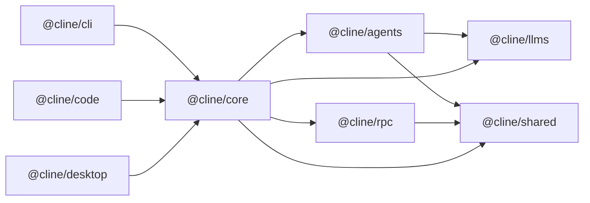

## Purpose

Single onboarding guide for contributors and agents. This repo is WIP and not production-bound, so full refactors are allowed without backward-compatibility shims.

## Workspace Map

This repo contains Bun workspace packages and apps.

Packages:

- `packages/shared` (`@cline/shared`): cross-package primitives (paths, common types, helpers).
- `packages/llms` (`@cline/llms`): provider settings schema, model catalog, handler creation.
- `packages/agents` (`@cline/agents`): stateless runtime loop, tools, hooks, teams.
- `packages/rpc` (`@cline/rpc`): transport/control-plane APIs (session CRUD, tasks, events, approvals).
- `packages/core` (`@cline/core`) stateful orchestration (runtime composition, sessions, storage, RPC-backed session adapter).

Apps:

- `apps/cli` (`@cline/cli`): command-line host/runtime wiring.
- `apps/code` (`@cline/code`): Tauri + Next.js app host/runtime wiring.
- `apps/desktop` (`@cline/desktop`): desktop app host/runtime wiring.

## Architecture

Dependency direction:

## Runtime Flows

### Local in-process flow

1. Host (`cli` / desktop app runner) builds runtime through `@cline/core`.
2. `@cline/core` composes tools/policies and runs `@cline/agents`.
3. `@cline/agents` uses `@cline/llms` handlers for model calls.
4. `@cline/core` persists session artifacts and state.

### RPC-backed flow

1. Host uses `RpcCoreSessionService` (through `@cline/core`) for session persistence/control-plane calls.
2. `@cline/rpc` server handles session/task/event/approval RPCs.
3. SQLite session backend is provided by `@cline/core/server` (`createSqliteRpcSessionBackend`).

### OAuth refresh ownership

- OAuth token refresh is owned by `@cline/core` session runtime (not UI/CLI clients).
- Managed OAuth providers: `cline`, `oca`, `openai-codex`.
- Core refreshes tokens pre-turn, persists refreshed credentials, and performs single-flight refresh in long-lived runtimes (for example RPC servers).

### `apps/code` startup flow (latest)

1. On launch, Tauri checks RPC health via `clite rpc status`.
2. If not healthy, it starts RPC in background via `clite rpc start`.
3. After health is confirmed, it registers the desktop client via `clite rpc register`.
4. Tauri starts a local persistent chat WebSocket bridge (`ws://127.0.0.1:<port>/chat`) and exposes the endpoint via `get_chat_ws_endpoint`.
5. `apps/code` UI opens one persistent socket and sends chat control commands (`start/send/abort/reset`) as request envelopes over that connection.
6. Host broadcasts chat stream events over the same socket using one canonical schema (`chat_event`) while still emitting `agent://chunk` for compatibility.
7. Host-to-runtime remains RPC/gRPC-backed via existing bridge scripts:
   - `apps/code/scripts/chat-create-session.ts` (`StartRuntimeSession`)
   - `apps/code/scripts/chat-agent-turn.ts` (`SendRuntimeSession`)
   - `apps/code/scripts/chat-stream-events.ts` (`StreamEvents`)

### `apps/code` canonical chat transport schema

- Command request envelope:
  - `{ "requestId": string, "request": ChatSessionCommandRequest }`
- Command response envelope:
  - `{ "type": "chat_response", "requestId": string, "response"?: ChatSessionCommandResponse, "error"?: string }`
- Stream event envelope:
  - `{ "type": "chat_event", "event": StreamChunkEvent }`

## Design System (UI apps)

For `apps/code` and `apps/desktop`:

- Framework: Next.js + React.
- Styling: Tailwind CSS (workspace convention) with CSS variables for tokens.
- Primitive components: Radix UI + local UI wrappers under `components/ui`.
- Form/state conventions: `react-hook-form`, `zod` validation, client-side hooks under `hooks/`.

Guideline: reuse existing `components/ui` primitives and tokenized styles before adding new visual patterns.

## Tooling and Standards

- Runtime/tooling: Bun workspaces/scripts.
- Language/module format: TypeScript + ESM.
- Lint/format: Biome (`biome.json`).
- Testing: Vitest (do not add `bun:test` tests).
- Prefer minimal, focused diffs; avoid unrelated refactors.
- Keep package boundaries explicit; move shared primitives to `@cline/shared`.

## Root Commands

- Install deps: `bun install`
- Build core SDK + CLI: `bun run build`
- Build apps (also regenerates models): `bun run build:apps`
- Build SDK only: `bun run build:sdk`
- Regenerate model metadata: `bun run build:models`
- Run code app from root: `bun run dev` or `bun run dev:code`
- Run desktop app from root: `bun run dev:desktop`
- Run CLI from source: `bun run dev:cli -- "<prompt>"`
- Typecheck all packages/apps: `bun run types`
- Run tests: `bun run test`
- Lint: `bun run lint`
- Format: `bun run format`
- Apply fixes: `bun run fix`

## Validation Checklist Before Merge

1. Run package-local typecheck/build for touched packages.
2. Run tests for touched areas (Vitest).
3. Run Biome checks or equivalent root scripts.
4. Update related README/docs when behavior, scripts, or architecture changes.

## Change Routing

- Provider/model schema changes: `@cline/llms`
- Tool/agent loop behavior: `@cline/agents`
- Session persistence/lifecycle/runtime assembly: `@cline/core`
- Remote/control-plane contracts: `@cline/rpc` (`packages/rpc/src/proto/rpc.proto`)
- Shared utility contracts: `@cline/shared`
