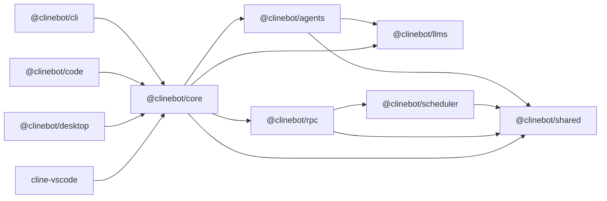

## Purpose

Single onboarding guide for contributors and agents. This repo is WIP and not production-bound, so full refactors are allowed without backward-compatibility shims or support requirements. The goal is to move fast and iterate on the core primitives and architecture, so we can converge on a solid foundation for future production work.

Always update the architecture and onboarding docs with any non-trivial changes to runtime flows, package responsibilities, or development workflow. This is the source of truth for how the system works and how to get new contributors up to speed effectively.

## Workspace Map

This repo contains Bun workspace packages and apps.

Packages:

- `packages/shared` (`@clinebot/shared`): cross-package primitives (paths, common types, helpers).
- `packages/llms` (`@clinebot/llms`): provider settings schema, model catalog, handler creation.
- `packages/scheduler` (`@clinebot/scheduler`): cron-based scheduled agent orchestration, execution limits, schedule/execution persistence, and transactional due-run claims with renewable leases for multi-ticker safety.
- `packages/agents` (`@clinebot/agents`): stateless runtime loop, tools, hooks, teams.
- `packages/rpc` (`@clinebot/rpc`): transport/control-plane APIs (session CRUD, tasks, events, approvals) plus runtime chat bridge implementation.
- `packages/core` (`@clinebot/core`) stateful orchestration (runtime composition, sessions, storage, RPC-backed session adapter) and app-facing re-exports for RPC helpers/shared contracts/path helpers (`RpcSessionClient`, `getRpcServerHealth`, runtime bridge helpers, `setHomeDir`, `normalizeUserInput`, etc.).

Apps:

- `apps/cli` (`@clinebot/cli`): command-line host/runtime wiring.
- `apps/code` (`@clinebot/code`): Tauri + Next.js app host/runtime wiring.
- `apps/desktop` (`@clinebot/desktop`): desktop app host/runtime wiring.
- `apps/vscode` (`cline-vscode`): VS Code extension host/runtime wiring with webview chat over RPC.

## Architecture

Dependency direction:



## Runtime Flows

### Local in-process flow

1. Host (`cli` / desktop app runner) builds runtime through `@clinebot/core`.
2. `@clinebot/core` composes tools/policies and runs `@clinebot/agents`.
3. `@clinebot/agents` uses `@clinebot/llms` handlers for model calls.
4. `@clinebot/core` persists session artifacts and state.

### RPC-backed flow

1. Host uses `RpcCoreSessionService` (through `@clinebot/core`) for session persistence/control-plane calls.
2. `@clinebot/rpc` server handles session/task/event/approval RPCs.
3. `@clinebot/rpc` embeds `@clinebot/scheduler` for `CreateSchedule/ListSchedules/...` APIs and scheduled runtime execution.
4. Scheduler ticks claim due runs in SQLite transactions with a renewable lease, then finalizes the claim after execution to advance `next_run_at` once.
5. SQLite session backend is provided by `@clinebot/core/server` (`createSqliteRpcSessionBackend`).

### `apps/cli` runtime bootstrap (latest)

1. CLI attempts a direct health/connect to `CLINE_RPC_ADDRESS` (default `127.0.0.1:4317`).
2. If no healthy server is available, CLI spawns `clite rpc start` in the background and retries briefly.
3. If RPC still cannot be reached, CLI falls back to local in-process `CoreSessionService` storage/runtime wiring.
4. CLI treats RPC `startRuntimeSession` artifact fields as optional at start time; runtime artifacts can be materialized after the first turn send.
5. Command-style subcommands that do not start an agent session (`--help`, `--version`, `sessions ...`, and similar lightweight dispatch paths) lazy-load runtime-only server modules so they do not inherit long-lived handles from the runtime import graph.

### `apps/cli` connector flow (latest)

1. `clite connect <adapter> ...` dispatches through a connector registry, so adapter integrations can be added without changing the CLI entrypoint contract.
2. `clite connect telegram -m <bot-username> -k <bot-token>` launches a background Telegram bridge by default (`-i` keeps it attached), while webhook adapters such as `clite connect gchat --base-url <public-url>` and `clite connect whatsapp --base-url <public-url>` launch background `node:http` webhook servers by default.
3. CLI ensures a compatible local RPC server for connector hosts and registers a `cli` RPC client tagged with connector metadata such as `transport=telegram`, `transport=gchat`, or `transport=whatsapp`.
4. Telegram runs through the Chat SDK polling adapter, while Google Chat and WhatsApp run through shared CLI `node:http` webhook servers that expose `/api/webhooks/gchat` and `/api/webhooks/whatsapp` for platform delivery.
5. On the first mention/DM in a connector thread, CLI starts one RPC runtime session, stores the `sessionId`, and persists the serialized Chat SDK thread so later messages and schedule deliveries can target the same conversation.
6. Later messages in that connector thread reuse the same RPC `sessionId` and call `sendRuntimeSession(...)` to continue the conversation. Connector bindings prefer the current Chat SDK `thread.id`, but Telegram can also recover an existing binding by stable channel identity after a process restart and migrate it to the new in-memory thread id.
7. Connector chat delivery behavior is centralized in shared CLI connector helpers, so adapters reuse the same incremental assistant-text streaming, compact tool start/error summaries with short argument previews, and `approval.requested` → `Y/N` prompt flow instead of reimplementing transport event handling.
8. Connector implementation is split between transport-specific adapter files and shared CLI modules under `apps/cli/src/connectors/`: `common.ts` (flag parsing/process + JSON helpers), `thread-bindings.ts` (serialized Chat SDK thread persistence), `session-runtime.ts` (provider/system-prompt/session bootstrap + cleanup), and `connector-host.ts` (slash commands, approval replies, queued turn handling, runtime streaming hooks).
9. Connector processes also subscribe to RPC server events such as `schedule.execution.completed`; when a schedule has matching `metadata.delivery`, the connector restores the target thread and posts the routine result back into the adapter thread.
10. Connector event hooks can be dispatched through `--hook-command <command>` (or `CLINE_CONNECT_HOOK_COMMAND`) for events like connector start/stop, inbound messages, completed replies, and scheduled deliveries.
11. The subprocess execution mechanism for both agent hooks and connector hooks is shared from `@clinebot/agents` (`packages/agents/src/hooks/subprocess-runner.ts`), while connector event schemas live in `@clinebot/shared` (`packages/shared/src/connectors/events.ts`) because they are transport/host contracts rather than agent lifecycle contracts.
12. Connector sessions start with tools/spawn/teams disabled by default; turning tools on for a thread also enables spawn/team tools for that thread. Changing `/tools`, `/yolo`, or `/cwd` clears the current RPC session binding so the next user message starts a fresh session with the updated runtime config. `/reset` stops and deletes the current RPC session for that thread, `/whereami` returns the delivery thread id for schedule targeting, and `/stop` shuts down the bridge process.
13. Telegram, Google Chat, and WhatsApp connectors also stop themselves when the RPC server broadcasts `rpc.server.shutting_down` or when the server event stream fails, so `clite rpc stop` tears down the background bridge instead of leaving connector processes behind.
14. The same slash-command parser is shared for connector chat surfaces and interactive CLI input, but CLI handling stays disabled by default unless `CLINE_ENABLE_CHAT_COMMANDS=1` is set.
15. `clite connect --stop` stops all running connector adapters and deletes their adapter-owned sessions; `clite connect --stop <adapter>` scopes the cleanup to one adapter by consulting its persisted connector state files.

### OAuth refresh ownership

- OAuth token refresh is owned by `@clinebot/core` session runtime (not UI/CLI clients).
- Managed OAuth providers: `cline`, `oca`, `openai-codex`.
- Core refreshes tokens pre-turn, persists refreshed credentials, and performs single-flight refresh in long-lived runtimes (for example RPC servers).

### `apps/code` startup flow (latest)

1. On launch, Tauri ensures a compatible RPC server via `clite rpc ensure --json`.
2. Tauri sets `CLINE_RPC_ADDRESS` to the ensured address.
3. Tauri registers the desktop client via `clite rpc register`.
4. Tauri starts a local persistent chat WebSocket bridge (`ws://127.0.0.1:<port>/chat`) and exposes the endpoint via `get_chat_ws_endpoint`.
5. `apps/code` UI opens one persistent socket and sends chat control commands (`start/send/abort/reset`) as request envelopes over that connection.
6. Host broadcasts chat stream events over the same socket using one canonical schema (`chat_event`) while still emitting `agent://chunk` for compatibility.
7. Host-to-runtime remains RPC/gRPC-backed via one persistent bridge script using `@clinebot/core` runtime helper re-exports:
   - `apps/code/scripts/chat-runtime-bridge.ts` (`start/send/abort/set_sessions/reset`)
   - re-exported helper: `runRpcRuntimeCommandBridge(...)` from `@clinebot/core` (implemented in `packages/rpc/src/runtime-chat-command-bridge.ts`)

### `apps/desktop` startup flow (latest)

1. On launch, Tauri ensures a compatible RPC server via `clite rpc ensure --json`.
2. Tauri sets `CLINE_RPC_ADDRESS` to the ensured address.
3. Tauri registers the desktop client via `clite rpc register`.
4. Tauri starts a local persistent chat WebSocket bridge (`ws://127.0.0.1:<port>/chat`) and exposes the endpoint via `get_chat_ws_endpoint`.
5. `apps/desktop` UI opens one persistent socket and sends chat control commands (`start/send/abort/reset`) as request envelopes over that connection.
6. Host broadcasts chat stream events over the same socket using canonical `chat_event` while still emitting `agent://chunk`.
7. Host-to-runtime uses one persistent desktop bridge script backed by `@clinebot/core` runtime helper re-exports:
   - `apps/desktop/scripts/chat-runtime-bridge.ts` (`start/send/abort/set_sessions/reset`)
   - re-exported helper: `runRpcRuntimeCommandBridge(...)` from `@clinebot/core` (implemented in `packages/rpc/src/runtime-chat-command-bridge.ts`)

### `apps/vscode` startup flow (latest)

1. Extension activation registers command `Cline: Open RPC Chat` and creates a webview panel.
2. On webview ready, extension ensures a compatible RPC server by invoking `clite rpc ensure --json`.
3. Extension sets `CLINE_RPC_ADDRESS` from ensure output and initializes `RpcSessionClient`.
4. Extension loads providers/models with `runProviderAction` (`listProviders`, `getProviderModels`) to hydrate UI selectors.
5. On first prompt send, extension starts a runtime session (`startRuntimeSession`) with webview-selected config.
6. Extension streams `runtime.chat.*` events via `streamEvents` for incremental text/tool updates and sends turns via `sendRuntimeSession`.
7. Webview controls support abort (`abortRuntimeSession`) and reset/new session (`stopRuntimeSession` + fresh start).

### Tool approval matching

- `tool_call_before` hooks can now return `review: true` in `AgentHookControl`.
- When `review: true` is returned, the runtime routes the tool call through the normal host approval callback / RPC approval flow before execution.
- This enables selective approval flows such as requiring approval for `run_commands` calls whose input starts with `git`, without changing default tool policy behavior for other calls.

### Model-aware default editor tool routing

- Default tool selection in `@clinebot/core` runtime builder now goes through an ordered model-tool routing rule engine (`packages/core/src/default-tools/model-tool-routing.ts`).
- Each rule can match by mode (`act` / `plan` / `any`) plus case-insensitive `modelIdIncludes` and optional `providerIdIncludes`, then enable/disable any default tools.
- Runtime applies rules in order and merges the resulting tool toggles onto the active preset before creating builtin tools.
- Built-in defaults include `act`-mode rules that enable `apply_patch` and disable `editor` for `providerId` containing `openai-native`, and for model IDs containing `codex` or `gpt`.
- Sessions can override/extend routing with `CoreSessionConfig.toolRoutingRules` for per-runtime customization without modifying runtime-builder code.

### Cline sub-agent prompt metadata

- For `providerId=cline`, spawned sub-agents (`spawn_agent`) now guarantee `# Workspace Configuration ...` metadata is present at the end of their system prompt.
- If the delegated system prompt already includes workspace metadata, runtime keeps it as-is.
- Otherwise, runtime appends metadata derived from the root session prompt when available, and falls back to a minimal metadata block based on the current `cwd`.

### `apps/code` canonical chat transport schema

- Command request envelope:
  - `{ "requestId": string, "request": ChatSessionCommandRequest }`
- Command response envelope:
  - `{ "type": "chat_response", "requestId": string, "response"?: ChatSessionCommandResponse, "error"?: string }`
- Stream event envelope:
  - `{ "type": "chat_event", "event": StreamChunkEvent }`

### Session title metadata (`apps/code`)

- User-edited session titles are persisted in each session manifest as `metadata.title`.
- Title updates are routed through backend session services (`clite sessions update` → `@clinebot/core` / RPC backend), which persist metadata in both session storage and manifests.
- Session discovery APIs (`list_chat_sessions`, `list_cli_sessions`) include parsed metadata for frontend consumers, so clients should prefer `metadata.title` over deriving titles from prompts/messages.

## Design System (UI apps)

For `apps/code` and `apps/desktop`:

- Framework: Next.js + React.
- Styling: Tailwind CSS (workspace convention) with CSS variables for tokens.
- Primitive components: Radix UI + local UI wrappers under `components/ui`.
- Form/state conventions: `react-hook-form`, `zod` validation, client-side hooks under `hooks/`.

Guideline: reuse existing `components/ui` primitives and tokenized styles before adding new visual patterns.

## Storage

### Path resolution (`@clinebot/shared` → `packages/shared/src/storage/paths.ts`)

All filesystem paths are derived from a mutable `HOME_DIR` (defaults to `$HOME`). Apps call `setHomeDir()` / `setHomeDirIfUnset()` early at startup (CLI, RPC runtime, bridge scripts) to anchor everything.

Base data directory: `~/.cline/data` (override: `CLINE_DATA_DIR`).

| Resolver | Default path | Env override |
|---|---|---|
| `resolveClineDataDir()` | `~/.cline/data` | `CLINE_DATA_DIR` |
| `resolveSessionDataDir()` | `~/.cline/data/sessions` | `CLINE_SESSION_DATA_DIR` |
| `resolveTeamDataDir()` | `~/.cline/data/teams` | `CLINE_TEAM_DATA_DIR` |
| `resolveProviderSettingsPath()` | `~/.cline/data/settings/providers.json` | `CLINE_PROVIDER_SETTINGS_PATH` |
| `resolveMcpSettingsPath()` | `~/.cline/data/settings/cline_mcp_settings.json` | `CLINE_MCP_SETTINGS_PATH` |

User-facing config directories live under `~/Documents/Cline/` (`Agents/`, `Hooks/`, `Rules/`, `Workflows/`). Workspace-scoped config is loaded from `.clinerules/`, `.cline/`, `.claude/`, or `.agents/` inside the workspace root. Config search-path helpers (`resolveAgentConfigSearchPaths`, `resolveSkillsConfigSearchPaths`, etc.) combine workspace + user-global + data-dir locations and deduplicate.

### Storage interfaces (`@clinebot/core` → `packages/core/src/types/storage.ts`)

Three interfaces define the storage contract consumed by session management:

- **`SessionStore`** — CRUD for `SessionRecord` rows (create, get, list, update, updateStatus, delete). The concrete implementation is `SqliteSessionStore` (`packages/core/src/storage/sqlite-session-store.ts`), which opens a `sessions.db` SQLite file inside `resolveSessionDataDir()`.
- **`ArtifactStore`** — append-only writes for session artifacts (transcript log, hook JSONL, messages JSON). Consumed via `SessionArtifacts` (`packages/core/src/session/session-artifacts.ts`), which creates per-session subdirectories under the sessions dir with files named `<sessionId>.log`, `<sessionId>.hooks.jsonl`, `<sessionId>.messages.json`. Sub-agent and team-task artifacts nest into subdirectories by agent/task ID.
- **`TeamStore`** — read-only access to team state and history (team names, state snapshots, history entries) from `resolveTeamDataDir()`.

### Provider settings (`@clinebot/core` → `packages/core/src/storage/provider-settings-manager.ts`)

`ProviderSettingsManager` reads/writes a JSON file at `resolveProviderSettingsPath()`. It stores per-provider settings keyed by provider ID, tracks `lastUsedProvider`, and validates with Zod schemas.

### Session lifecycle through storage

`CoreSessionService` (`packages/core/src/session/session-service.ts`) wires `SqliteSessionStore` + `SessionArtifacts` together. `DefaultSessionManager` (`packages/core/src/session/default-session-manager.ts`) consumes a `SessionBackend` (either local `CoreSessionService` or remote `RpcCoreSessionService`) and exposes the high-level `SessionManager` interface (start, send, abort, stop, dispose, read artifacts).
`DefaultSessionManager` persists `messages.json` for both successful and failed turns, and team task failure events now carry teammate message snapshots so failed team-task sub-sessions also retain their rendered message history.
`DefaultSessionManager` is also the source of truth for per-session accumulated usage totals; apps should query `sessionManager.getAccumulatedUsage(sessionId)` instead of aggregating usage in app-level runtime code.

## Tooling and Standards

- Runtime/tooling: Bun workspaces/scripts.
- Language/module format: TypeScript + ESM.
- Lint/format: Biome (`biome.json`).
- Testing: Vitest (do not add `bun:test` tests).
- Prefer minimal, focused diffs; avoid unrelated refactors.
- Keep package boundaries explicit; move shared primitives to `@clinebot/shared`.

## Root Commands

- Install deps: `bun install`
- Build core SDK + CLI: `bun run build`
- Build apps (also regenerates models): `bun run build:apps`
- Build SDK only: `bun run build:sdk`
- Build Apps only: `bun run build:apps`
- Regenerate model metadata: `bun run build:models`
- Build SDK + run CLI interactively: `bun run dev`
- Run code app from root: `bun run dev:code`
- Run desktop app from root: `bun run dev:desktop`
- Run CLI from source: `bun run dev:cli -- "<prompt>"`
- Build VS Code extension app: `bun -F cline-vscode build`
- Typecheck VS Code extension app: `bun -F cline-vscode typecheck`
- Typecheck all packages/apps: `bun run types`
- Run tests: `bun run test`
- Run scheduler/routine verification script: `bun run verify:routines`
- Lint: `bun run lint`
- Format: `bun run format`
- Apply fixes: `bun run fix`

## Development Workflow Notes

### Rebuilding after package changes

SDK packages compile TypeScript to `dist/`. When you change source in any package, dependent packages and apps use the compiled output — **they do not pick up source changes automatically** (except when running with `--conditions=development` via `dev:cli`, `dev:code`, `dev:desktop`).

After editing a package, rebuild it before running tests or other packages:

```bash
# Rebuild a single package
bun -F @clinebot/shared build
bun -F @clinebot/llms build
bun -F @clinebot/scheduler build
bun -F @clinebot/agents build
bun -F @clinebot/rpc build
bun -F @clinebot/core build
bun -F @clinebot/cli build

# Rebuild all SDK packages in dependency order
bun run build:sdk

# Rebuild everything (SDK + CLI)
bun run build
```

Build order for SDK packages (dependency order): `shared → llms → scheduler → (rpc, agents in parallel) → core`

### RPC server restart required after changes

The RPC server (`clite rpc start`) loads compiled code at startup. After making changes to **any package the RPC server depends on** (`@clinebot/shared`, `@clinebot/llms`, `@clinebot/scheduler`, `@clinebot/agents`, `@clinebot/rpc`, `@clinebot/core`, or `@clinebot/cli`), you must:

1. Rebuild the affected packages (`bun run build:sdk` or the individual `build:<package>` script).
2. Stop the running RPC server (`clite rpc stop` or Ctrl+C on the `clite rpc start` process).
3. Restart it (`clite rpc start` or `clite rpc ensure`).

Without a restart the server continues running the old compiled code regardless of source changes.

## Validation Checklist Before Merge

1. Run package-local typecheck/build for touched packages.
2. Run tests for touched areas (Vitest).
3. Run Biome checks or equivalent root scripts.
4. Update related README/docs when behavior, scripts, or architecture changes.

## Change Routing

- Provider/model schema changes: `@clinebot/llms`
- Scheduled runtime orchestration and cron execution: `@clinebot/scheduler`
- Tool/agent loop behavior: `@clinebot/agents`
- Session persistence/lifecycle/runtime assembly: `@clinebot/core`
- Remote/control-plane contracts: `@clinebot/rpc` (`packages/rpc/src/proto/rpc.proto`)
- Shared utility contracts: `@clinebot/shared`
