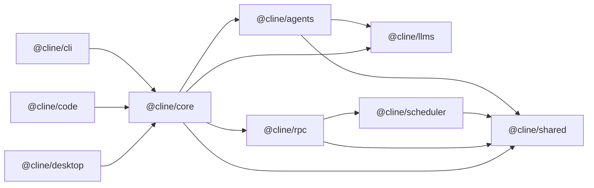

## Purpose

Single onboarding guide for contributors and agents. This repo is WIP and not production-bound, so full refactors are allowed without backward-compatibility shims or support requirements. The goal is to move fast and iterate on the core primitives and architecture, so we can converge on a solid foundation for future production work.

Always update the architecture and onboarding docs with any non-trivial changes to runtime flows, package responsibilities, or development workflow. This is the source of truth for how the system works and how to get new contributors up to speed effectively.

## Workspace Map

This repo contains Bun workspace packages and apps.

Packages:

- `packages/shared` (`@cline/shared`): cross-package primitives (paths, common types, helpers).
- `packages/llms` (`@cline/llms`): provider settings schema, model catalog, handler creation.
- `packages/scheduler` (`@cline/scheduler`): cron-based scheduled agent orchestration, execution limits, and schedule/execution persistence.
- `packages/agents` (`@cline/agents`): stateless runtime loop, tools, hooks, teams.
- `packages/rpc` (`@cline/rpc`): transport/control-plane APIs (session CRUD, tasks, events, approvals) plus shared runtime chat client helpers (`RpcRuntimeChatClient`, `runRpcRuntimeEventBridge`, `runRpcRuntimeCommandBridge`).
- `packages/core` (`@cline/core`) stateful orchestration (runtime composition, sessions, storage, RPC-backed session adapter).

Apps:

- `apps/cli` (`@cline/cli`): command-line host/runtime wiring.
- `apps/code` (`@cline/code`): Tauri + Next.js app host/runtime wiring.
- `apps/desktop` (`@cline/desktop`): desktop app host/runtime wiring.

## Architecture

Dependency direction:



## Runtime Flows

### Local in-process flow

1. Host (`cli` / desktop app runner) builds runtime through `@cline/core`.
2. `@cline/core` composes tools/policies and runs `@cline/agents`.
3. `@cline/agents` uses `@cline/llms` handlers for model calls.
4. `@cline/core` persists session artifacts and state.

### RPC-backed flow

1. Host uses `RpcCoreSessionService` (through `@cline/core`) for session persistence/control-plane calls.
2. `@cline/rpc` server handles session/task/event/approval RPCs.
3. `@cline/rpc` embeds `@cline/scheduler` for `CreateSchedule/ListSchedules/...` APIs and scheduled runtime execution.
4. SQLite session backend is provided by `@cline/core/server` (`createSqliteRpcSessionBackend`).

### `apps/cli` runtime bootstrap (latest)

1. CLI attempts a direct health/connect to `CLINE_RPC_ADDRESS` (default `127.0.0.1:4317`).
2. If no healthy server is available, CLI spawns `clite rpc start` in the background and retries briefly.
3. If RPC still cannot be reached, CLI falls back to local in-process `CoreSessionService` storage/runtime wiring.

### OAuth refresh ownership

- OAuth token refresh is owned by `@cline/core` session runtime (not UI/CLI clients).
- Managed OAuth providers: `cline`, `oca`, `openai-codex`.
- Core refreshes tokens pre-turn, persists refreshed credentials, and performs single-flight refresh in long-lived runtimes (for example RPC servers).

### `apps/code` startup flow (latest)

1. On launch, Tauri ensures a compatible RPC server via `clite rpc ensure --json`.
2. Tauri sets `CLINE_RPC_ADDRESS` to the ensured address.
3. Tauri registers the desktop client via `clite rpc register`.
4. Tauri starts a local persistent chat WebSocket bridge (`ws://127.0.0.1:<port>/chat`) and exposes the endpoint via `get_chat_ws_endpoint`.
5. `apps/code` UI opens one persistent socket and sends chat control commands (`start/send/abort/reset`) as request envelopes over that connection.
6. Host broadcasts chat stream events over the same socket using one canonical schema (`chat_event`) while still emitting `agent://chunk` for compatibility.
7. Host-to-runtime remains RPC/gRPC-backed via one persistent bridge script using shared `@cline/rpc` runtime helpers:
   - `apps/code/scripts/chat-runtime-bridge.ts` (`start/send/abort/set_sessions/reset`)
   - shared helper: `runRpcRuntimeCommandBridge(...)` in `packages/rpc/src/runtime-chat-command-bridge.ts`

### `apps/desktop` startup flow (latest)

1. On launch, Tauri ensures a compatible RPC server via `clite rpc ensure --json`.
2. Tauri sets `CLINE_RPC_ADDRESS` to the ensured address.
3. Tauri registers the desktop client via `clite rpc register`.
4. Tauri starts a local persistent chat WebSocket bridge (`ws://127.0.0.1:<port>/chat`) and exposes the endpoint via `get_chat_ws_endpoint`.
5. `apps/desktop` UI opens one persistent socket and sends chat control commands (`start/send/abort/reset`) as request envelopes over that connection.
6. Host broadcasts chat stream events over the same socket using canonical `chat_event` while still emitting `agent://chunk`.
7. Host-to-runtime uses one persistent desktop bridge script backed by shared `@cline/rpc` helpers:
   - `apps/desktop/scripts/chat-runtime-bridge.ts` (`start/send/abort/set_sessions/reset`)
   - shared helper: `runRpcRuntimeCommandBridge(...)` in `packages/rpc/src/runtime-chat-command-bridge.ts`

### `apps/code` canonical chat transport schema

- Command request envelope:
  - `{ "requestId": string, "request": ChatSessionCommandRequest }`
- Command response envelope:
  - `{ "type": "chat_response", "requestId": string, "response"?: ChatSessionCommandResponse, "error"?: string }`
- Stream event envelope:
  - `{ "type": "chat_event", "event": StreamChunkEvent }`

## Design System (UI apps)

For `apps/code` and `apps/desktop`:

- Framework: Next.js + React.
- Styling: Tailwind CSS (workspace convention) with CSS variables for tokens.
- Primitive components: Radix UI + local UI wrappers under `components/ui`.
- Form/state conventions: `react-hook-form`, `zod` validation, client-side hooks under `hooks/`.

Guideline: reuse existing `components/ui` primitives and tokenized styles before adding new visual patterns.

## Storage

### Path resolution (`@cline/shared` → `packages/shared/src/storage/paths.ts`)

All filesystem paths are derived from a mutable `HOME_DIR` (defaults to `$HOME`). Apps call `setHomeDir()` / `setHomeDirIfUnset()` early at startup (CLI, RPC runtime, bridge scripts) to anchor everything.

Base data directory: `~/.cline/data` (override: `CLINE_DATA_DIR`).

| Resolver | Default path | Env override |
|---|---|---|
| `resolveClineDataDir()` | `~/.cline/data` | `CLINE_DATA_DIR` |
| `resolveSessionDataDir()` | `~/.cline/data/sessions` | `CLINE_SESSION_DATA_DIR` |
| `resolveTeamDataDir()` | `~/.cline/data/teams` | `CLINE_TEAM_DATA_DIR` |
| `resolveProviderSettingsPath()` | `~/.cline/data/settings/providers.json` | `CLINE_PROVIDER_SETTINGS_PATH` |
| `resolveMcpSettingsPath()` | `~/.cline/data/settings/cline_mcp_settings.json` | `CLINE_MCP_SETTINGS_PATH` |

User-facing config directories live under `~/Documents/Cline/` (`Agents/`, `Hooks/`, `Rules/`, `Workflows/`). Workspace-scoped config is loaded from `.clinerules/`, `.cline/`, `.claude/`, or `.agents/` inside the workspace root. Config search-path helpers (`resolveAgentConfigSearchPaths`, `resolveSkillsConfigSearchPaths`, etc.) combine workspace + user-global + data-dir locations and deduplicate.

### Storage interfaces (`@cline/core` → `packages/core/src/types/storage.ts`)

Three interfaces define the storage contract consumed by session management:

- **`SessionStore`** — CRUD for `SessionRecord` rows (create, get, list, update, updateStatus, delete). The concrete implementation is `SqliteSessionStore` (`packages/core/src/storage/sqlite-session-store.ts`), which opens a `sessions.db` SQLite file inside `resolveSessionDataDir()`.
- **`ArtifactStore`** — append-only writes for session artifacts (transcript log, hook JSONL, messages JSON). Consumed via `SessionArtifacts` (`packages/core/src/session/session-artifacts.ts`), which creates per-session subdirectories under the sessions dir with files named `<sessionId>.log`, `<sessionId>.hooks.jsonl`, `<sessionId>.messages.json`. Sub-agent and team-task artifacts nest into subdirectories by agent/task ID.
- **`TeamStore`** — read-only access to team state and history (team names, state snapshots, history entries) from `resolveTeamDataDir()`.

### Provider settings (`@cline/core` → `packages/core/src/storage/provider-settings-manager.ts`)

`ProviderSettingsManager` reads/writes a JSON file at `resolveProviderSettingsPath()`. It stores per-provider settings keyed by provider ID, tracks `lastUsedProvider`, and validates with Zod schemas.

### Session lifecycle through storage

`CoreSessionService` (`packages/core/src/session/session-service.ts`) wires `SqliteSessionStore` + `SessionArtifacts` together. `DefaultSessionManager` (`packages/core/src/session/default-session-manager.ts`) consumes a `SessionBackend` (either local `CoreSessionService` or remote `RpcCoreSessionService`) and exposes the high-level `SessionManager` interface (start, send, abort, stop, dispose, read artifacts).

## Tooling and Standards

- Runtime/tooling: Bun workspaces/scripts.
- Language/module format: TypeScript + ESM.
- Lint/format: Biome (`biome.json`).
- Testing: Vitest (do not add `bun:test` tests).
- Prefer minimal, focused diffs; avoid unrelated refactors.
- Keep package boundaries explicit; move shared primitives to `@cline/shared`.

## Root Commands

- Install deps: `bun install`
- Build core SDK + CLI: `bun run build`
- Build apps (also regenerates models): `bun run build:apps`
- Build SDK only: `bun run build:sdk`
- Build Apps only: `bun run build:apps`
- Regenerate model metadata: `bun run build:models`
- Build SDK + run CLI interactively: `bun run dev`
- Run code app from root: `bun run dev:code`
- Run desktop app from root: `bun run dev:desktop`
- Run CLI from source: `bun run dev:cli -- "<prompt>"`
- Typecheck all packages/apps: `bun run types`
- Run tests: `bun run test`
- Lint: `bun run lint`
- Format: `bun run format`
- Apply fixes: `bun run fix`

## Development Workflow Notes

### Rebuilding after package changes

SDK packages compile TypeScript to `dist/`. When you change source in any package, dependent packages and apps use the compiled output — **they do not pick up source changes automatically** (except when running with `--conditions=development` via `dev:cli`, `dev:code`, `dev:desktop`).

After editing a package, rebuild it before running tests or other packages:

```bash
# Rebuild a single package
bun -F @cline/shared build
bun -F @cline/llms build
bun -F @cline/scheduler build
bun -F @cline/agents build
bun -F @cline/rpc build
bun -F @cline/core build
bun -F @cline/cli build

# Rebuild all SDK packages in dependency order
bun run build:sdk

# Rebuild everything (SDK + CLI)
bun run build
```

Build order for SDK packages (dependency order): `shared → llms → scheduler → (rpc, agents in parallel) → core`

### RPC server restart required after changes

The RPC server (`clite rpc start`) loads compiled code at startup. After making changes to **any package the RPC server depends on** (`@cline/shared`, `@cline/llms`, `@cline/scheduler`, `@cline/agents`, `@cline/rpc`, `@cline/core`, or `@cline/cli`), you must:

1. Rebuild the affected packages (`bun run build:sdk` or the individual `build:<package>` script).
2. Stop the running RPC server (`clite rpc stop` or Ctrl+C on the `clite rpc start` process).
3. Restart it (`clite rpc start` or `clite rpc ensure`).

Without a restart the server continues running the old compiled code regardless of source changes.

## Validation Checklist Before Merge

1. Run package-local typecheck/build for touched packages.
2. Run tests for touched areas (Vitest).
3. Run Biome checks or equivalent root scripts.
4. Update related README/docs when behavior, scripts, or architecture changes.

## Change Routing

- Provider/model schema changes: `@cline/llms`
- Scheduled runtime orchestration and cron execution: `@cline/scheduler`
- Tool/agent loop behavior: `@cline/agents`
- Session persistence/lifecycle/runtime assembly: `@cline/core`
- Remote/control-plane contracts: `@cline/rpc` (`packages/rpc/src/proto/rpc.proto`)
- Shared utility contracts: `@cline/shared`
