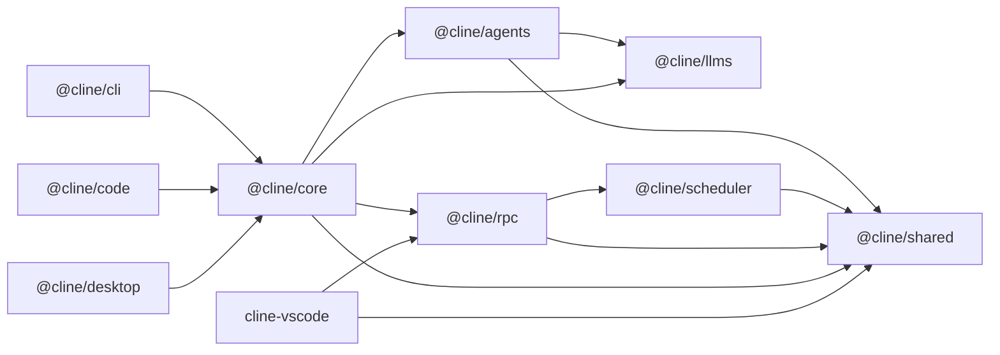
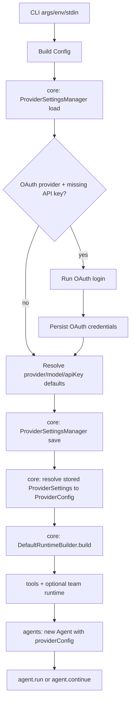
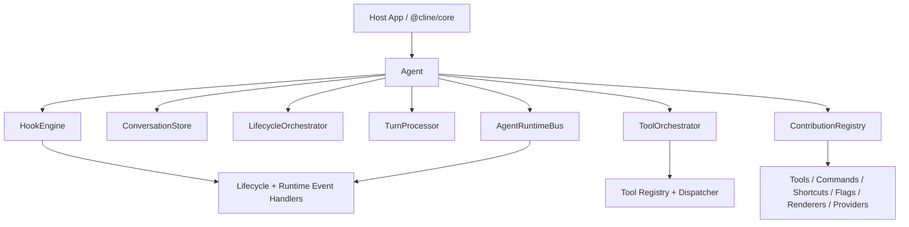

# Cline SDK Architecture

This document is the single architecture source of truth for this repository.

For contributor workflow/setup details, see [`AGENTS.md`](/Users/beatrix/dev/clinee/sdk-wip/AGENTS.md).

## Workspace Map

Packages:

- `packages/shared` (`@cline/shared`): cross-package primitives (paths, common types, helpers).
- `packages/llms` (`@cline/llms`): provider settings schema, model catalog, handler creation.
- `packages/scheduler` (`@cline/scheduler`): cron-based scheduled execution service and persistence.
- `packages/agents` (`@cline/agents`): stateless runtime loop, tools, hooks, teams.
- `packages/rpc` (`@cline/rpc`): transport/control-plane APIs (session CRUD, tasks, events, approvals) plus shared runtime chat client helpers.
- `packages/core` (`@cline/core`): stateful orchestration (runtime composition, sessions, storage, RPC-backed session adapter).

Apps:

- `apps/cli` (`@cline/cli`): command-line host/runtime wiring.
- `apps/code` (`@cline/code`): Tauri + Next.js app host/runtime wiring.
- `apps/desktop` (`@cline/desktop`): desktop app host/runtime wiring.
- `apps/vscode` (`cline-vscode`): VS Code extension host/runtime wiring with webview chat over RPC.

## Dependency Direction



## Runtime Flows

### Local in-process flow

1. Host (`cli` / desktop app runner) builds runtime through `@cline/core`.
2. `@cline/core` composes tools/policies and runs `@cline/agents`.
3. `@cline/agents` uses `@cline/llms` handlers for model calls.
4. `@cline/core` persists session artifacts and state.

### RPC-backed flow

1. Host uses `RpcCoreSessionService` (through `@cline/core`) for session persistence/control-plane calls.
2. `@cline/rpc` server handles session/task/event/approval RPCs and schedule/execution RPCs.
3. `@cline/rpc` embeds `@cline/scheduler` to trigger scheduled runtime turns with concurrency and timeout guards.
4. SQLite session backend is provided by `@cline/core/server` (`createSqliteRpcSessionBackend`).

### Session persistence implementation (latest)

1. `@cline/core` now routes both local (`CoreSessionService`) and RPC (`RpcCoreSessionService`) session persistence through one shared implementation: `UnifiedSessionPersistenceService`.
2. Backend-specific differences are isolated in adapters:
   - Local adapter (`SqliteSessionStore`-backed SQL/session queue operations)
   - RPC adapter (`RpcSessionClient`-backed CRUD/queue operations)
3. Session artifact/manifest writes, subagent session upserts, team task sub-session lifecycle, and child-session status propagation are now executed by the shared service logic to keep behavior identical across local and RPC backends.

### Desktop Kanban session discovery (latest)

1. `apps/desktop` Kanban session discovery reads directly from the root SQLite sessions DB at `~/.cline/data/sessions/sessions.db`.
2. This avoids dependency on workspace CLI resolution for loading persisted history and keeps board hydration aligned with the canonical session store.
3. Session/task mutation commands (for example session delete or subprocess launch) still use CLI commands.

### VS Code extension runtime flow (latest)

1. `apps/vscode` registers command `Cline: Open RPC Chat` and launches a webview panel.
2. Extension host ensures RPC compatibility through `clite rpc ensure --json` (same server bootstrap strategy used by CLI/Tauri hosts).
3. Extension host creates `RpcSessionClient` against the ensured `CLINE_RPC_ADDRESS`.
4. Provider/model selector data is loaded using runtime provider actions (`listProviders`, `getProviderModels`).
5. Chat turns run through runtime RPC methods (`StartRuntimeSession`, `SendRuntimeSession`, `AbortRuntimeSession`, `StopRuntimeSession`).
6. Stream updates are consumed from `StreamEvents` (`runtime.chat.text_delta`, tool lifecycle events) and forwarded to the webview.

### Team runtime durability and convergence (latest)

1. `@cline/agents` provides in-memory team orchestration primitives (tasks, mailbox, mission log, async run scheduler, outcome fragments/finalization gates).
2. `@cline/core` persists team runtime state and lifecycle events through `SqliteTeamStore` (`~/.cline/data/teams/teams.db` by default).
3. Team lifecycle is append-only in `team_events`, with materialized projections in `team_tasks`, `team_runs`, `team_outcomes`, and `team_outcome_fragments`.
4. On restart, `DefaultRuntimeBuilder` restores the team snapshot by `teamName` and marks stale queued/running runs as `interrupted` for deterministic recovery.
5. `DefaultSessionManager` keeps the lead loop alive while async teammate runs are active and auto-continues the lead agent with system-delivered run terminal updates when runs complete/fail/cancel/interrupted.

## CLI (`@cline/cli`)

`@cline/cli` is the executable shell around the runtime stack. It parses CLI input into runtime config, composes runtime capabilities via `@cline/core/node`, executes agent loops via `@cline/agents/node`, resolves provider metadata via `@cline/llms/node`, and optionally runs the RPC gateway via `@cline/rpc/node`.

Workspace boundary rule:

- Use explicit Node runtime imports: `@cline/llms/node`, `@cline/agents/node`, `@cline/rpc/node`.
- Import core runtime services from `@cline/core/server/node` and shared contracts from `@cline/core/node`.

### Runtime composition

1. Parse args/env/stdin into config.
2. Load provider settings from core storage.
3. If OAuth provider is selected and no API key exists, run OAuth login and persist credentials.
4. Persist effective provider/model selection.
5. `DefaultSessionManager` resolves persisted provider settings (`providers.json`) and converts them to full `ProviderConfig` (including provider-specific fields like `aws`, `gcp`, `azure`, `sap`, `oca`), then overlays runtime overrides (`model`, `apiKey`, `baseUrl`, `headers`, `thinking`).
6. Build runtime via `DefaultRuntimeBuilder.build(...)`.
7. Start `Agent` and run `agent.run(...)` or `agent.continue(...)`.



### Streaming and rendering path

- CLI constructs `Agent` with `onEvent` callback.
- Agent emits event stream (`text`, tool lifecycle, usage, done, error).
- CLI renders incrementally in `apps/cli/src/index.ts` via `handleEvent(...)`.
- Text chunks are written directly to stdout and transcript artifacts.

### Tool approval modes

1. Terminal mode (default): prompt on TTY, deny required approvals on non-TTY.
2. Desktop file-IPC mode (`CLINE_TOOL_APPROVAL_MODE=desktop`): write requests to `CLINE_TOOL_APPROVAL_DIR`, poll for decision JSON, timeout if no decision.
3. Hook-requested review: `tool_call_before` hooks can return `review: true` to force the normal approval request flow for that tool call before execution.

### CLI RPC server lifecycle

- `clite rpc start`: starts in-process gateway if no server is already active.
- `clite rpc status`: probes server health.
- `clite rpc stop`: requests graceful shutdown.

### CLI connector bridge flow

`clite connect <adapter>` adds a long-running host integration path on top of the existing CLI RPC bootstrap:

1. The command dispatches through a connector registry, so adapter-specific bridges can share one CLI entrypoint.
2. The Telegram connector launches a detached background bridge by default (`-i` keeps it foregrounded), ensures a compatible local RPC server (`clite rpc ensure` behavior), and registers a `cli` client with `transport=telegram`.
3. CLI runs the Chat SDK Telegram adapter in polling mode, so Telegram talks to the laptop bridge process while the RPC server remains bound to localhost.
4. Each Telegram thread gets one RPC runtime session id plus a persisted serialized thread binding, allowing both later user messages and out-of-band schedule deliveries to target the same conversation.
5. First incoming message starts `StartRuntimeSession`; later messages call `SendRuntimeSession` against the stored session id.
6. `runtime.chat.text_delta` events are converted into a streamed Telegram reply via Chat SDK's post+edit fallback.
7. Connector processes also subscribe to RPC server events such as `schedule.execution.completed`; if schedule metadata includes a matching `delivery` target, the connector restores the adapter thread and posts the result back through the adapter.
8. Connector subprocess hooks reuse the same execution primitive exported by `@cline/agents` (`runSubprocessEvent(...)`), while connector event payload schemas live in `@cline/shared` because they are host/transport contracts rather than agent lifecycle contracts.
9. A shared chat-command parser handles connector slash commands such as `/reset`, `/whereami`, `/tools`, `/yolo`, and `/cwd`; the same parser is available to interactive CLI input but remains disabled there by default.
10. `/reset` in Telegram clears the stored session binding and best-effort stops/deletes the matching RPC session, `/whereami` reports the delivery thread id, `/tools` and `/yolo` update runtime safety posture, `/cwd` updates cwd/workspace root, and `/stop` shuts down the bridge process itself.
11. Telegram sessions start with tools/spawn/teams disabled by default; enabling tools for a thread also enables spawn/team tools for that thread. Changing `/tools`, `/yolo`, or `/cwd` clears the current session binding so the next user message starts a fresh runtime with the updated config. The connector also exits when the RPC server broadcasts `rpc.server.shutting_down` or when its server event stream fails, so `clite rpc stop` tears down the background poller instead of leaving it running against a dead server.
12. `clite connect --stop` enumerates adapter state files under `~/.cline/data/connectors/`, terminates matching bridge processes, and deletes sessions whose persisted metadata belongs to that adapter; `clite connect --stop <adapter>` scopes the same cleanup to a single adapter implementation.

## OAuth Refresh Ownership

OAuth token refresh is owned by `@cline/core` session runtime (not UI/CLI clients).

Managed OAuth providers:

- `cline`
- `oca`
- `openai-codex`

Core refreshes tokens pre-turn, persists refreshed credentials, and performs single-flight refresh in long-lived runtimes (for example RPC servers).

## Agents Runtime (`@cline/agents`)

`@cline/agents` is the stateless runtime layer for:

- agent loop execution
- hook dispatch and policies
- extension contribution registration
- in-memory team orchestration

Stateful concerns (plugin discovery/loading, trust/sandbox policy, persistence) belong in `@cline/core`.

### Runtime layers



### Execution model and state

This package keeps one canonical in-memory conversation (`providers.Message[]`) and iterates until it can return a final answer.

Conversation state buckets:

- Persistent per conversation (`ConversationStore`):
  - `messages`: full conversation history used for future turns
  - `conversationId`: reset by `run()`, `clearHistory()`, and `restore()`
  - `sessionStarted`: ensures `session_start` runs once per conversation
- Ephemeral per run:
  - `activeRunId`
  - `abortController`
  - loop counters, aggregated usage, collected tool call records

Run APIs:

- `run(input)` starts a new conversation and clears previous history.
- `continue(input)` appends a new user message to existing history.
- `restore(messages)` (or `initialMessages`) preloads history for resume flows; use `continue()` next to preserve that history.

Message preparation path:

```text
Canonical History (this.messages)
  -> MessageBuilder.buildForApi(...)
  -> requestMessages
  -> handler.createMessage(systemPrompt, requestMessages, toolDefinitions)
```

`MessageBuilder` can trim oversized tool outputs and mark superseded read-file results while leaving canonical history unchanged.

Iteration loop (high level):

```text
user input
  -> iteration_start
  -> turn_start
  -> before_agent_start
  -> model stream (text/reasoning/tool_calls/usage)
  -> assistant message persisted
  -> if no tool calls: iteration_end + done
  -> if tool calls:
       execute tools in parallel
       persist tool_result message
       iteration_end
       next iteration
```

Tool-call arguments are buffered from stream chunks and finalized at end-of-turn using `parseJsonStream`, so tools execute against finalized payloads instead of partial JSON fragments.

### Runtime events and hook order

`AgentEvent` (from `onEvent`) event types:

- `iteration_start`
- `content_start` (`text` | `reasoning` | `tool`)
- `content_end` (`text` | `reasoning` | `tool`)
- `usage`
- `iteration_end`
- `done`
- `error`

Blocking hook stages dispatch order during a run:

1. `session_start` (first run in a conversation only)
2. `run_start`
3. For each iteration:
   - `iteration_start`
   - `turn_start`
   - `before_agent_start`
   - `tool_call_before` / `tool_call_after` (for each tool call when present)
   - `turn_end`
   - `iteration_end`
4. `run_end`

Additional stages:

- `error` on loop failure
- `session_shutdown` when host calls `agent.shutdown(...)`
- `runtime_event` for extension-level observation of emitted runtime events

Lifecycle transitions are emitted through `AgentRuntimeBus`, and lifecycle dispatch is owned by `LifecycleOrchestrator`.

### Hook system

`HookEngine` is the only runtime hook execution path.

Hook stages:

- `input`
- `session_start`
- `run_start`
- `iteration_start`
- `turn_start`
- `before_agent_start`
- `tool_call_before`
- `tool_call_after`
- `turn_end`
- `iteration_end`
- `run_end`
- `runtime_event`
- `session_shutdown`
- `error`

Dispatch behavior:

- Blocking stages return merged `AgentHookControl`.
- Async stages are queued with per-stage queue and concurrency limits.
- Handler execution order is deterministic: higher `priority` first, then handler name.
- Stage/handler policies control timeout, retries, failure mode, max concurrency, and queue limit.

Control merge model:

- `cancel`: logical OR
- `context`: newline-joined
- `overrideInput`: last writer wins
- `systemPrompt`: last writer wins
- `appendMessages`: concatenated in handler order

### Extension lifecycle and responsibilities

Extensions are manifest-first and follow a deterministic setup lifecycle:

1. `resolve`
2. `validate`
3. `setup`
4. `activate`
5. `run`

No dynamic extension registration occurs during `run`.

Inside `@cline/agents`:

- validate extension manifests
- register contributions via `setup(api)`
- register hook handlers to `HookEngine`

Outside `@cline/agents` (in `@cline/core`):

- discover modules from disk
- load/instantiate modules
- apply trust/sandbox policy
- persist plugin/runtime state

### Performance guardrails

- Hook stage defaults include bounded timeout/retry behavior.
- Async stages use bounded queue limits.
- Per-stage concurrency budgets are enforced.
- Tool execution fan-out is bounded by `AgentConfig.maxParallelToolCalls` (default `8`).
- Hook routing is stage-indexed; dispatch does not scan unrelated handlers.
- Extension contribution setup runs once per agent lifecycle.

## Desktop App (`@cline/desktop`)

`@cline/desktop` splits responsibilities into four layers:

1. Frontend (Next.js): Kanban board UI and user interactions.
2. Desktop runtime (Tauri/Rust): process orchestration and transport bridge.
3. RPC runtime (CLI RPC server): shared session runtime and event bus.
4. Execution engine (CLI + Agents): task-card subprocess execution with hooks.

Boundary rule:

- Frontend/browser modules: `@cline/llms/browser`
- Node runtime hosts (CLI/Tauri scripts): `@cline/llms/node`, `@cline/agents/node`, `@cline/core/node`, `@cline/core/server/node`, `@cline/rpc/node`

### Layer details

Frontend (`apps/desktop/components/kanban-board.tsx`):

- manages card lifecycle (`queued -> running -> completed|failed|cancelled`)
- sends task-card commands to Tauri (`start_session`, `stop_session`, and related commands)
- opens one persistent websocket endpoint (`get_chat_ws_endpoint`) and sends chat command envelopes (`start/send/abort/reset`)
- listens for `chat_event` stream envelopes and compatibility events (`agent://chunk`)

Tauri backend (`apps/desktop/src-tauri/src/main.rs`):

- ensures/registers RPC server at app startup (`clite rpc ensure`, `clite rpc register`)
- spawns one CLI subprocess per task card
- streams stdout/stderr chunk events to frontend
- runs a local websocket bridge with canonical chat envelopes:
  - request: `{ requestId, request }`
  - response: `{ type: "chat_response", requestId, response|error }`
  - event: `{ type: "chat_event", event }`
- runs one persistent chat runtime bridge script (`apps/desktop/scripts/chat-runtime-bridge.ts`) with `start/send/abort/set_sessions/reset`

RPC runtime (`apps/cli/src/commands/rpc.ts`, `apps/cli/src/commands/rpc-runtime.ts`):

- hosts shared runtime handlers (`start/send/abort runtime session`)
- publishes runtime chat events (`runtime.chat.text_delta`, `runtime.chat.tool_call_*`)
- owns stateful runtime/session lifecycle via `@cline/core/server`

CLI + Agents (`apps/cli/src/index.ts`):

- runs agent loop (interactive and single-prompt modes)
- enables tools/spawn/team runtime per session config
- appends structured hook logs
- persists session registry + metadata in SQLite (`sessions.db`)

### Session registry and status locking

Session registry:

- SQLite location: `~/.cline/data/sessions/sessions.db` (or `CLINE_SESSION_DATA_DIR`)
- key table: `sessions` (`session_id`, `status`, `status_lock`, `pid`, `provider`, `model`, `cwd`, file paths, timestamps)

Optimistic lock strategy for status transitions:

1. Read `status_lock`.
2. `UPDATE ... WHERE session_id = ? AND status_lock = ?`.
3. Increment `status_lock` on success.
4. Retry when lock changed.

This avoids concurrent-writer races between runtime updates and exit handlers.

### Desktop session lifecycle

1. User creates card in UI.
2. UI sends `start_session` with model/provider/task settings.
3. Tauri launches CLI with subprocess hooks enabled.
4. CLI runs task and emits output + hook events.
5. CLI stores session state in SQLite and updates status with lock checks.
6. Tauri relays output chunks and polls/loads persisted sessions.
7. UI imports unknown sessions as cards, updates progress from hooks/transcript polling, and finalizes status from registry/process events.

### Why this design

- isolation: each card has an independent process
- recoverability: transcript/hook JSONL files preserve runtime history
- observable progress: hooks provide structured progress beyond console output
- extensibility: Tauri command layer can add pause/resume/retry without changing UI contract
