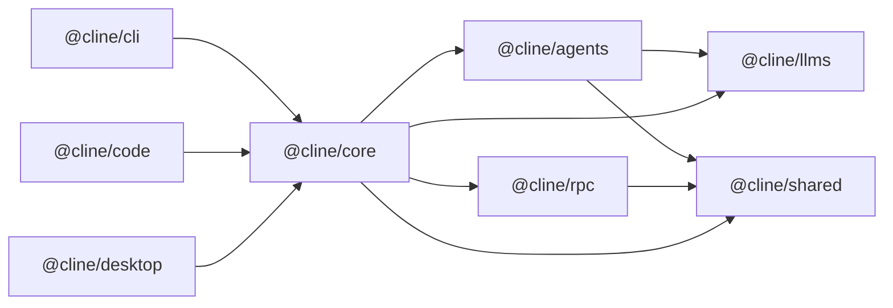
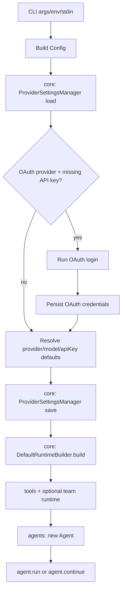

# Cline SDK Architecture

This document is the single architecture source of truth for this repository.

For contributor workflow/setup details, see [`AGENTS.md`](/Users/beatrix/dev/clinee/sdk-wip/AGENTS.md).

## Workspace Map

Packages:

- `packages/shared` (`@cline/shared`): cross-package primitives (paths, common types, helpers).
- `packages/llms` (`@cline/llms`): provider settings schema, model catalog, handler creation.
- `packages/agents` (`@cline/agents`): stateless runtime loop, tools, hooks, teams.
- `packages/rpc` (`@cline/rpc`): transport/control-plane APIs (session CRUD, tasks, events, approvals) plus shared runtime chat client helpers.
- `packages/core` (`@cline/core`): stateful orchestration (runtime composition, sessions, storage, RPC-backed session adapter).

Apps:

- `apps/cli` (`@cline/cli`): command-line host/runtime wiring.
- `apps/code` (`@cline/code`): Tauri + Next.js app host/runtime wiring.
- `apps/desktop` (`@cline/desktop`): desktop app host/runtime wiring.

## Dependency Direction

## Runtime Flows

### Local in-process flow

1. Host (`cli` / desktop app runner) builds runtime through `@cline/core`.
2. `@cline/core` composes tools/policies and runs `@cline/agents`.
3. `@cline/agents` uses `@cline/llms` handlers for model calls.
4. `@cline/core` persists session artifacts and state.

### RPC-backed flow

1. Host uses `RpcCoreSessionService` (through `@cline/core`) for session persistence/control-plane calls.
2. `@cline/rpc` server handles session/task/event/approval RPCs.
3. SQLite session backend is provided by `@cline/core/server` (`createSqliteRpcSessionBackend`).

### Desktop Kanban session discovery (latest)

1. `apps/desktop` Kanban session discovery reads directly from the root SQLite sessions DB at `~/.cline/data/sessions/sessions.db`.
2. This avoids dependency on workspace CLI resolution for loading persisted history and keeps board hydration aligned with the canonical session store.
3. Session/task mutation commands (for example session delete or subprocess launch) still use CLI commands.

### Team runtime durability and convergence (latest)

1. `@cline/agents` provides in-memory team orchestration primitives (tasks, mailbox, mission log, async run scheduler, outcome fragments/finalization gates).
2. `@cline/core` persists team runtime state and lifecycle events through `SqliteTeamStore` (`~/.cline/data/teams/teams.db` by default).
3. Team lifecycle is append-only in `team_events`, with materialized projections in `team_tasks`, `team_runs`, `team_outcomes`, and `team_outcome_fragments`.
4. On restart, `DefaultRuntimeBuilder` restores the team snapshot by `teamName` and marks stale queued/running runs as `interrupted` for deterministic recovery.
5. `DefaultSessionManager` keeps the lead loop alive while async teammate runs are active and auto-continues the lead agent with system-delivered run terminal updates when runs complete/fail/cancel/interrupted.

## CLI (`@cline/cli`)

`@cline/cli` is the executable shell around the runtime stack. It parses CLI input into runtime config, composes runtime capabilities via `@cline/core/node`, executes agent loops via `@cline/agents/node`, resolves provider metadata via `@cline/llms/node`, and optionally runs the RPC gateway via `@cline/rpc/node`.

Workspace boundary rule:

- Use explicit Node runtime imports: `@cline/llms/node`, `@cline/agents/node`, `@cline/rpc/node`.
- Import core runtime services from `@cline/core/server/node` and shared contracts from `@cline/core/node`.

### Runtime composition

1. Parse args/env/stdin into config.
2. Load provider settings from core storage.
3. If OAuth provider is selected and no API key exists, run OAuth login and persist credentials.
4. Persist effective provider/model selection.
5. Build runtime via `DefaultRuntimeBuilder.build(...)`.
6. Start `Agent` and run `agent.run(...)` or `agent.continue(...)`.

### Streaming and rendering path

- CLI constructs `Agent` with `onEvent` callback.
- Agent emits event stream (`text`, tool lifecycle, usage, done, error).
- CLI renders incrementally in `apps/cli/src/index.ts` via `handleEvent(...)`.
- Text chunks are written directly to stdout and transcript artifacts.

### Tool approval modes

1. Terminal mode (default): prompt on TTY, deny required approvals on non-TTY.
2. Desktop file-IPC mode (`CLINE_TOOL_APPROVAL_MODE=desktop`): write requests to `CLINE_TOOL_APPROVAL_DIR`, poll for decision JSON, timeout if no decision.

### CLI RPC server lifecycle

- `clite rpc start`: starts in-process gateway if no server is already active.
- `clite rpc status`: probes server health.
- `clite rpc stop`: requests graceful shutdown.

## OAuth Refresh Ownership

OAuth token refresh is owned by `@cline/core` session runtime (not UI/CLI clients).

Managed OAuth providers:

- `cline`
- `oca`
- `openai-codex`

Core refreshes tokens pre-turn, persists refreshed credentials, and performs single-flight refresh in long-lived runtimes (for example RPC servers).
