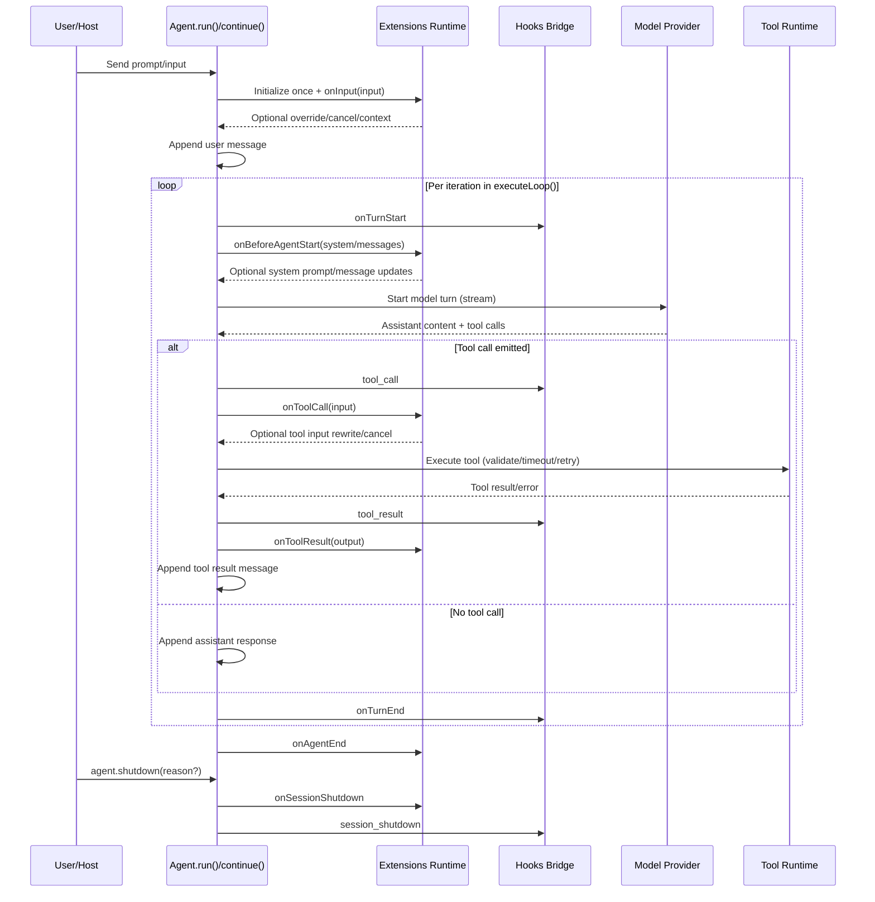

# @cline/agents Architecture

## Goals

- Provide a compact, high-level runtime for agentic tool-calling loops.
- Keep model/provider integration abstract via `@cline/llms/providers`.
- Consume canonical provider config contracts from `@cline/llms/providers` without owning persistence schemas.
- Support first-class extension interception across session, input, model start, tools, and shutdown.

## Core Building Blocks

- `Agent` (`/Users/beatrix/dev/cline/packages/agents/src/agent.ts`)
  - Owns loop state (`messages`, iterations, usage, tool records)
  - Coordinates model turns and tool execution
  - Integrates hooks and extensions across lifecycle boundaries
- Extensions runtime (`/Users/beatrix/dev/cline/packages/agents/src/extensions.ts`)
  - Loads extension modules
  - Supports filesystem discovery/loading helpers for startup/reload workflows
  - Exposes registration API for tools/commands/shortcuts/flags/renderers/providers
  - Dispatches extension lifecycle events and merges controls
- Hooks bridge (`/Users/beatrix/dev/cline/packages/agents/src/hooks.ts`)
  - Subprocess hook adapter (`runHook`, `createSubprocessHooks`)
  - Pi-style event payload dispatch (`tool_call`, `tool_result`, `agent_end`, `session_shutdown`)
- Tool layer (`/Users/beatrix/dev/cline/packages/agents/src/tools/*`)
  - Tool definition validation and execution (authorization/timeout/retry/abort)
- Types/contracts (`/Users/beatrix/dev/cline/packages/agents/src/types.ts`)
  - Public API contracts for agent config, hooks, extensions, events, and results

## Extensions vs Hooks

- `extensions` are the primary interception and composition mechanism in `AgentConfig.extensions`.
- `hooks` are lifecycle callbacks in `AgentConfig.hooks` and include the subprocess bridge (`createSubprocessHooks`) for external event handling.

## Discovery and Loading

Extension loading can be host-managed using helpers:

- `discoverExtensionModules(directory)` for recursive filesystem discovery
- `loadExtensionModule(path, options)` for dynamic import of one module
- `loadExtensionsFromPaths(paths, options)` for batch loading

This keeps module discovery/reload policy explicit at the host layer while preserving a typed runtime contract in the agent package.

## Extension Lifecycle

`AgentConfig.extensions` accepts extension modules implementing optional handlers:

- `setup` (register contributions)
- `onSessionStart`
- `onInput`
- `onBeforeAgentStart`
- `onToolCall`
- `onToolResult`
- `onAgentEnd`
- `onSessionShutdown`
- `onRuntimeEvent`
- `onError`

Control-bearing handlers can return:

- `{ cancel: true }` to abort run
- `{ context: "..." }` to append model-visible context block
- `{ overrideInput: ... }` to rewrite input/tool input
- `onBeforeAgentStart` additionally supports:
  - `systemPrompt` override
  - `appendMessages` injection

## Runtime Flow

1. `run()` / `continue()`
   - initializes extensions once
   - executes extension `onInput` before user message is appended
2. `executeLoop()`
   - triggers `onSessionStart` once per conversation
   - per iteration triggers:
     - hook `onTurnStart`
     - extension `onBeforeAgentStart` (system prompt/message mutation)
     - model call + stream processing
     - hook/extension turn-end handlers
3. Tool execution
   - emits events
   - runs hook + extension interception on tool start/end
   - supports tool input rewrite before execution
   - authorizes each tool call against `toolPolicies` and optional `requestToolApproval`
4. Shutdown
   - `agent.shutdown(reason?)` triggers extension + hook session shutdown handlers

## Extension Contributions

Extensions can register:

- tools
- commands
- shortcuts
- flags
- message renderers
- providers

The agent merges extension tools with config tools and validates the final set before execution.

## Subprocess Hook Bridge

`createSubprocessHooks()` offers a thin adapter that forwards lifecycle payloads to a CLI subprocess (default `agent hook`), enabling external systems to handle:

- allowlists/policy
- transcript processing
- redaction/upload
- commit tracking

Only `tool_call` is blocking by default; other events are fire-and-forget.

## Tool Authorization Layer

`AgentConfig` supports a centralized policy gate before tool execution:

- `toolPolicies`: per-tool config (`enabled`, `autoApprove`) with optional wildcard `*`
- `requestToolApproval`: host callback for interactive approval when `autoApprove` is `false`

Authorization order for each tool call:

1. Resolve effective policy (`*` merged with tool-specific overrides)
2. If `enabled === false`, deny immediately
3. If `autoApprove === false`, call `requestToolApproval(...)`
4. If denied/not approved, return tool error record and skip execution
5. If allowed, execute tool with existing timeout/retry/abort behavior

## Reliability and Error Policy

- Tool execution: timeout + retry + abort propagation
- Hook/extension failures respect `hookErrorMode`:
  - `"ignore"`: emit recoverable error event and continue
  - `"throw"`: fail run on lifecycle invocations that are awaited
- Unknown tools are captured as tool error records

## File Map

- `/Users/beatrix/dev/cline/packages/agents/src/agent.ts`
- `/Users/beatrix/dev/cline/packages/agents/src/extensions.ts`
- `/Users/beatrix/dev/cline/packages/agents/src/hooks.ts`
- `/Users/beatrix/dev/cline/packages/agents/src/types.ts`
- `/Users/beatrix/dev/cline/packages/agents/src/tools/execution.ts`
