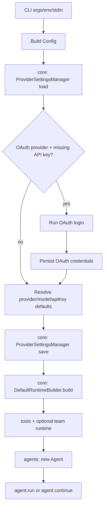
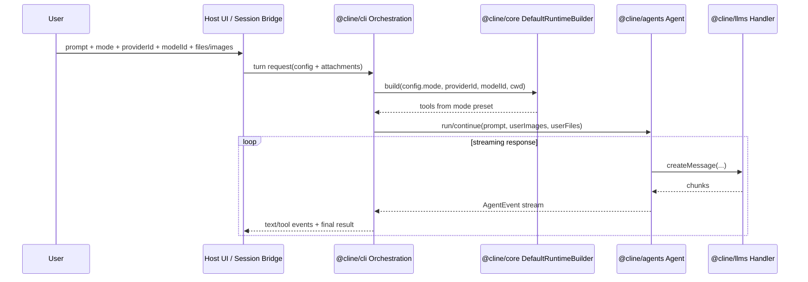
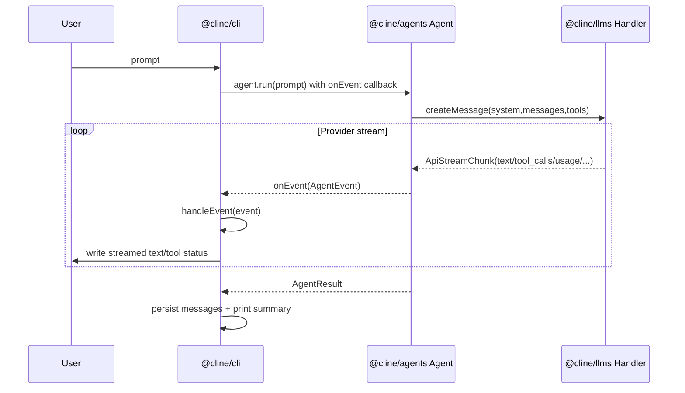

# @cline/cli Architecture

This document explains how `@cline/cli` consumes `@cline/core/node`, `@cline/core/server/node`, `@cline/agents/node`, `@cline/llms/node`, and `@cline/rpc/node`, with a focus on streaming output and tool-approval flow.

Workspace boundary rule:
- use explicit Node runtime imports: `@cline/llms/node`, `@cline/agents/node`, `@cline/rpc/node`
- import core runtime services from `@cline/core/server/node` and shared core contracts from `@cline/core/node`

## Package Role

`@cline/cli` is the executable shell around the agent runtime. It does four main jobs:

- Parse CLI input and environment into runtime config.
- Compose runtime capabilities (tools, teams, spawn support) via `@cline/core/node`.
- Execute agent loops via `@cline/agents/node`.
- Fetch model metadata and provider handlers via `@cline/llms/node` (indirectly through agents, directly for model catalog lookup).
- Expose an optional gRPC gateway lifecycle command via `@cline/rpc/node` (`clite rpc start`).

## Dependency Boundaries

### `@cline/core/node` + `@cline/core/server/node` consumption

Primary usage in `cli/src/index.ts`:

- `DefaultRuntimeBuilder`
  - Builds runtime tool list and optional team runtime.
  - Handles team persistence bootstrap via core-owned runtime wiring.
- `createTeamName`
  - Generates team names when team mode is enabled.
- `enrichPromptWithMentions` and `prewarmFileIndex`
  - Enriches `@mentions`/file context in user prompts.
- `generateWorkspaceInfo`
  - Builds workspace metadata used to construct the default system prompt.
- `ProviderSettingsManager`
  - Loads persisted provider settings (provider/model/auth) from core-managed storage.
  - Persists the effective provider/model selection so future CLI/desktop runs reuse the same defaults.
  - Persists OAuth credentials after `clite auth <provider>` and auto-auth flows.
- Session and manifest types/services (through CLI utilities)
  - CLI writes and updates session artifacts for local auditability.

### `@cline/agents/node` consumption

Primary usage in `cli/src/index.ts`:

- `Agent`
  - Main execution engine used for both single-shot and interactive loops.
- `createBuiltinTools`
  - CLI default tool set (read/search/bash/web-fetch).
- `createSubprocessHooks`
  - Hook bridge for tool and lifecycle events (`hook` subcommand).
- `createSpawnAgentTool`
  - Optional spawn tool for delegated/sub-agent execution.
- Agent/team event and policy types
  - `AgentEvent`, `TeamEvent`, `ToolPolicy`, tool approval contracts.

### `@cline/llms/node` consumption

Two paths:

- Direct in CLI:
  - `resolveProviderConfig()` to resolve/refresh provider model lists at startup.
- Indirect through agents:
  - `Agent` constructs a provider handler with `createHandler(...)` from `@cline/llms/node`.
  - Streaming chunks from handlers are normalized as `ApiStreamChunk` values.

### OAuth auth flow

- CLI supports OAuth providers: `cline`, `openai-codex`, `oca`.
- Two entrypoints:
  - explicit: `clite auth <provider>`
  - implicit: when selected provider is OAuth-capable and no API key is configured
- CLI resolves runtime OAuth helpers from `@cline/core/server/node` and runs login callbacks in terminal I/O mode.
- On success, CLI persists:
  - `settings.apiKey` (provider-ready API key)
  - `settings.auth.accessToken`
  - `settings.auth.refreshToken`
  - `settings.auth.accountId`

### `@cline/rpc/node` consumption

Primary usage in `cli/src/index.ts`:

- `getRpcServerHealth(address)`
  - Probes whether a gateway is already listening.
- `startRpcServer({ address })`
  - Starts the singleton in-process server if one is not already active.
- `stopRpcServer()`
  - Graceful shutdown on `SIGINT`/`SIGTERM` in `clite rpc start`.

## Runtime Composition Flow

## End-to-End Prompt Payload Flow

For hosts that route prompt turns through the CLI/runtime stack (including desktop/app chat runners), the payload carries:

- `mode` (`act` or `plan`, default `act`)
- `providerId`
- `modelId`
- prompt text
- optional attachments:
  - `userImages` (data URLs)
  - `userFiles` (`name` + `content`)

Flow summary:

1. Host/UI collects prompt + model/provider + mode + attachments.
2. Host serializes turn request and starts/uses runtime session.
3. Runtime builder selects tool preset from mode:
   - `act` -> development preset
   - `plan` -> readonly preset
4. Agent executes `run(...)`/`continue(...)` with prompt + attachments.
5. Streamed events/results flow back to host for rendering/persistence.

## Streaming Path: Agent to CLI Output

The CLI does not currently consume `streamRun(...)` directly. Instead it uses `Agent` callbacks:

1. CLI constructs `new Agent({ ..., onEvent })`.
2. CLI calls `agent.run(...)` or `agent.continue(...)`.
3. Inside `Agent`, `processTurn()` iterates provider stream chunks from llms handler:
   - `for await (const chunk of handler.createMessage(...))`
4. `Agent` converts chunks into high-level `AgentEvent` callbacks:
   - `text` chunk -> emits `{ type: "text", text, accumulated }`
   - `tool_calls` chunk -> accumulates tool call payloads
   - `usage` chunk -> updates usage counters
   - `done` chunk -> final turn completion/error state
5. CLI `onEvent` handler (`handleEvent`) renders each event immediately:
   - `text` -> `process.stdout.write(event.text)` (streamed token/chunk display)
   - `tool_call_start` / `tool_call_end` -> formatted tool telemetry
   - `done` -> prints finish banner
   - `error` -> prints error line
6. After completion, CLI persists final messages and optional usage/timing summary.

### Stream Lifecycle Diagram

## Where Streaming Is Rendered

Key rendering function in CLI:

- `handleEvent(event, config)` in `cli/src/index.ts`
  - Text streaming is the `case "text": write(event.text)` branch.
  - `write(...)` writes to stdout and also appends to transcript artifact files.

This means terminal output is event-driven and incremental, not buffered until the end.

## Tool Approval Flow

Approval is enforced by `@cline/agents` via `toolPolicies` + `requestToolApproval(...)`. CLI supplies the approval callback in two modes:

1. Terminal mode (default):
   - Prompt on TTY: approve/reject per call.
   - Non-TTY: required approvals are denied.
2. Desktop file-IPC mode (`CLINE_TOOL_APPROVAL_MODE=desktop`):
   - CLI writes request JSON into `CLINE_TOOL_APPROVAL_DIR`.
   - CLI polls for matching decision JSON and resolves approval.
   - Times out (default 5 minutes) if no decision arrives.

This keeps approval semantics in the shared agent runtime, while host transport/UI can vary.

## Single Prompt vs Interactive

Both modes use the same streaming mechanism:

- Single prompt: creates agent per run and calls `agent.run(...)`.
- Interactive mode: reuses one agent instance across turns and calls `run(...)` once, then `continue(...)` for next turns.

In both cases, streamed text appears through the same `onEvent -> handleEvent -> write` path.

## Notes on Core vs CLI Responsibilities

- Core runtime builder is responsible for capability composition (tools/team runtime lifecycle).
- Core settings manager is responsible for provider settings schema + persistence shape.
- CLI is responsible for presentation, session artifact persistence, and user I/O.
- CLI is responsible for precedence and selection policy at startup:
  - explicit CLI flags
  - persisted provider-scoped settings from core
  - built-in defaults/live catalog fallback
- Agents owns loop semantics and event emission.
- Agents owns approval policy enforcement (`toolPolicies`, `requestToolApproval` invocation).
- LLMS owns provider-specific streaming and normalization into unified chunks.
- RPC package owns gateway transport for cross-client/session/task routing when launched via `clite rpc start`.
