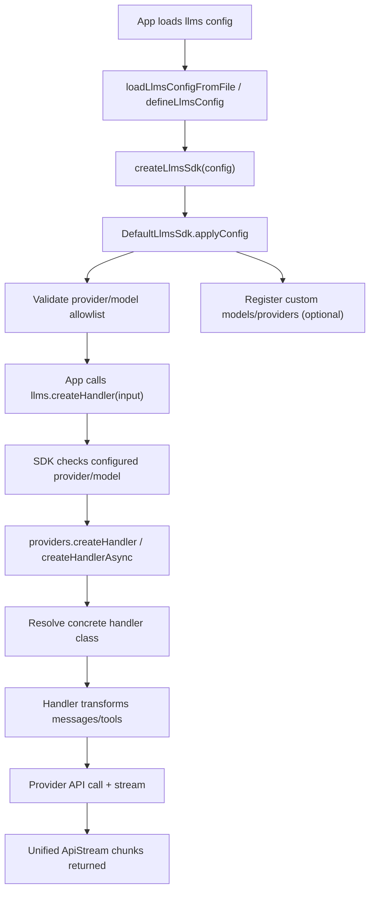

# @cline/llms Architecture

This document explains how `@cline/llms` is structured after consolidating the old `models` and `providers` packages into one package, and how requests flow from SDK config to streamed model output.

## Goals

- Provide a single package for all LLM concerns:
  - model catalog + query
  - provider configuration + handler creation
  - config-driven SDK for app-level allowlists and extension
- Keep model metadata and runtime handlers connected but decoupled:
  - `models/*` owns model metadata and registry
  - `providers/*` owns API calls, message transforms, and streaming
  - `sdk.ts` composes both and enforces app-level configuration

## High-Level Layout

- `src/index.ts`
  - root export surface
- `src/config.ts`
  - config-file loading helpers (`loadLlmsConfigFromFile`, `defineLlmsConfig`)
- `src/types.ts`
  - SDK-level config and runtime types
- `src/sdk.ts`
  - config-driven orchestration layer (`createLlmsSdk`)

- `src/models/*`
  - model schemas, provider model catalogs, lazy model registry, query APIs
- `src/providers/*`
  - provider config/types, handler factories, provider-specific implementations, transforms, utilities

- `scripts/generate-models-dev.ts`
  - generates `src/models/providers/models-dev.generated.ts` from models.dev

## Export Surfaces

`package.json` exports the package in three layers:

- `@cline/llms`
  - SDK + config helpers
- `@cline/llms/models`
  - model-centric APIs (catalog, queries, registry)
- `@cline/llms/providers`
  - provider handler APIs (create handlers, register custom handlers, transforms, utils)

This allows consumers to stay on one npm package while importing only the layer they need.

## Core Boundaries

### 1. Models Layer (`src/models/*`)

Responsibilities:

- Define strongly typed model schema and query schema (`schemas/*`)
- Hold provider model definitions (`models/providers/*`)
- Manage lazy-loaded model registry and runtime registration (`registry.ts`)
- Provide query helpers/builders over model metadata (`query.ts`)

Key behavior:

- Provider catalogs are loaded lazily by provider id.
- Runtime model/provider registration merges custom entries with built-ins.
- Query APIs operate over the merged catalog.

### 2. Providers Layer (`src/providers/*`)

Responsibilities:

- Define unified provider config and message/stream types (`types/*`)
- Build concrete handlers by provider (`index.ts`, `handlers/*`)
- Translate normalized messages/tools into provider-native wire format (`transform/*`)
- Stream and normalize provider output into unified chunks (`utils/stream-processor.ts`)
- Serve as canonical provider settings schema source for upstream packages (`ProviderSettingsSchema`/`ProviderConfig` in `types/settings.ts` and `types/config.ts`)

Key behavior:

- `createHandler` / `createHandlerAsync` choose built-in or custom-registered handlers.
- OpenAI-compatible providers share defaults in `handlers/providers.ts`.
- Custom sync/async handlers can be registered in `handlers/registry.ts`.

### 3. SDK Layer (`src/sdk.ts`)

Responsibilities:

- Apply app config allowlist for providers/models.
- Enforce “only configured provider/model may be used”.
- Merge default provider settings and per-request overrides.
- Expose runtime extension points:
  - `registerProvider`
  - `registerModel`

Key behavior:

- On initialization, it validates provider/model selections from `LlmsConfig`.
- It registers custom models/providers into model registry.
- It delegates actual handler instantiation to providers layer.

## End-to-End Runtime Flow

## Detailed Flows

### A. SDK Initialization Flow

1. Config is loaded from JSON or passed inline (`src/config.ts`).
2. `createLlmsSdk` constructs `DefaultLlmsSdk` (`src/sdk.ts`).
3. `applyConfig`:
   - validates each configured provider has at least one model
   - resolves default model
   - resolves API key from `apiKey` or `apiKeyEnv`
   - stores per-provider defaults in SDK state
4. Optional custom entries are applied:
   - `models[]` => `registerModelInCatalog`
   - `customProviders[]` => `registerProviderInCatalog` + optional handler registration
5. Final validation ensures every configured provider exists in model registry.

### B. Handler Creation Flow

1. App calls `llms.createHandler({ providerId, modelId?, overrides? })`.
2. SDK checks provider exists in configured allowlist.
3. SDK resolves final model id (explicit or provider default).
4. SDK validates model is allowed for that provider.
5. SDK builds provider config by merging:
   - provider defaults from SDK config
   - per-call overrides
6. SDK calls providers layer `createHandler` (or async version).
7. Providers layer returns concrete handler implementation.

### C. Message Processing + Streaming Flow

1. App calls handler `createMessage(systemPrompt, messages, tools?)`.
2. Handler converts normalized messages/tools into provider-native format via `transform/*`.
3. Handler sends request through provider SDK/client.
4. Stream chunks are normalized into unified chunk types (`text`, `reasoning`, `tool_calls`, `usage`).
5. Caller consumes one unified stream interface regardless of provider.

## Model Metadata Flow

There are two model metadata sources:

- Curated static provider files under `src/models/providers/*`
- Generated `models-dev` file under `src/models/providers/models-dev.generated.ts`

`src/providers/handlers/providers.ts` merges these sources for openai-compatible providers, so handler known-model metadata stays aligned with central model catalog.

## Extension Points

### Runtime model extension

- `llms.registerModel({ providerId, modelId, info })`
- Adds model to model registry and SDK allowlist state.

### Runtime provider extension

- `llms.registerProvider({ collection, defaults?, handlerFactory?, asyncHandlerFactory?, exposeModels?, defaultModel? })`
- Adds provider metadata and model set.
- Optionally registers sync/async handler implementation.
- Updates SDK allowlist state.

### Custom handler registry (providers layer)

- `registerHandler(providerId, factory)`
- `registerAsyncHandler(providerId, factory)`

Custom handlers take precedence over built-ins.

## Config Model

Primary SDK config type: `LlmsConfig` (`src/types.ts`):

- `providers: ProviderSelectionConfig[]`
  - provider id
  - allowed model ids
  - default model
  - provider defaults (api key env/base url/headers/timeouts/capabilities/settings)
- `models?: AdditionalModelConfig[]`
  - additional runtime model entries
- `customProviders?: CustomProviderConfig[]`
  - full custom provider collection + optional handler factories

This is intentionally strict: config defines what is allowed, not just preferred defaults.

## Error Handling Strategy

- SDK layer throws early on invalid config and disallowed provider/model usage.
- Providers layer handles runtime API failures and retry behavior (`providers/utils/retry.ts`).
- Stream normalization ensures callers can handle errors and completions uniformly across providers.

## Build and Typecheck

- Package build: `bun run build` (TypeScript emit to `dist`)
- Package typecheck: `bun run typecheck`
- Root scripts call `llms` first, then downstream packages (`agents`, `cli`, `web`, `desktop`).

## Design Tradeoffs

- Keeping `models/*` and `providers/*` as internal submodules preserves separation of concerns while removing multi-package overhead.
- Single-package distribution simplifies dependency management for consumers.
- Subpath exports maintain clean API boundaries and avoid forcing SDK-only usage.

## Future Improvements

- Add explicit runtime schema validation for full `LlmsConfig` in `config.ts` (currently minimal structural checks).
- Add snapshot/integration tests for:
  - config allowlist enforcement
  - custom provider registration precedence
  - model catalog merge behavior
- Consider splitting internal build configs per submodule if compile options diverge.
