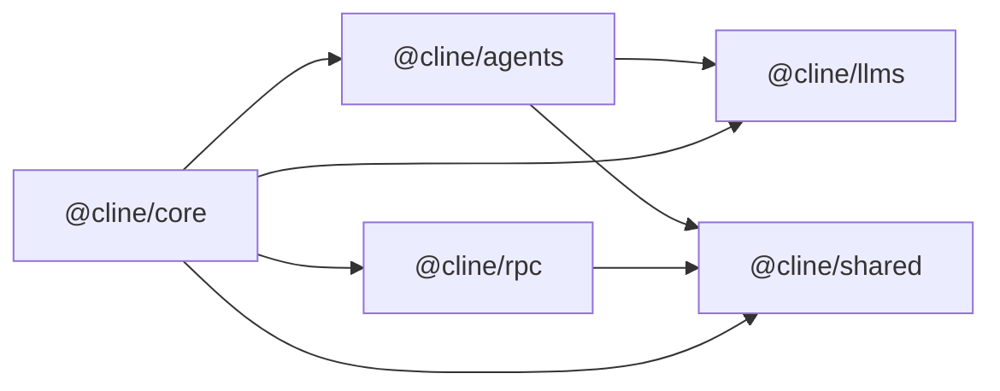
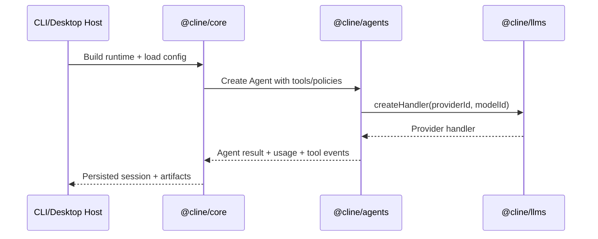
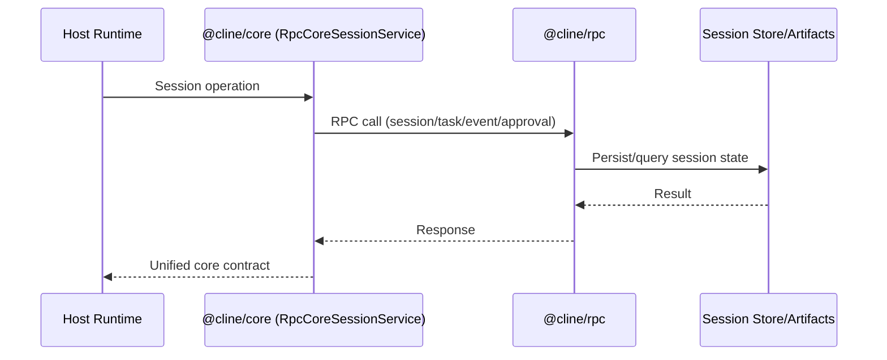

# Packages Architecture

This document defines the high-level architecture across workspace packages and the intended dependency direction.

## Dependency Direction

Design intent:
- `shared` and `llms` are foundational libraries.
- `agents` is a runtime layer that is stateless per run.
- `core` is the stateful orchestration layer for full host runtimes.
- `rpc` is transport/control-plane infrastructure used by `core` or host apps.

## Layered Responsibilities

1. Foundation
- `@cline/shared`: canonical shared constants/types/helpers across packages.
- `@cline/llms`: canonical provider settings schema + model catalog + handler factories.

2. Runtime
- `@cline/agents`: execution loop, tool orchestration, hooks/extensions, teams.

3. Orchestration
- `@cline/core`: runtime composition, persistent sessions, storage, config loaders, RPC session adapter.

4. Transport
- `@cline/rpc`: server/client APIs for session CRUD, task lifecycle, events, spawn queue, and tool approvals.

## Main Runtime Flows

### 1) Local In-Process Flow

### 2) RPC-Backed Session Flow

## Ownership Boundaries

- Provider settings schema ownership: `@cline/llms`.
- Agent loop/tool execution ownership: `@cline/agents`.
- Persistent session lifecycle/storage ownership: `@cline/core`.
- RPC transport schema/service ownership: `@cline/rpc` (`src/proto/rpc.proto`).
- Shared path/session common ownership: `@cline/shared`.

## Change Guidelines

- If a change affects provider/model contracts, update `@cline/llms` first.
- If a change affects tool-call lifecycle semantics, update `@cline/agents`.
- If a change introduces persistence or cross-run state, it belongs in `@cline/core`.
- If a change introduces remote/control-plane coordination, it belongs in `@cline/rpc`.
- If multiple packages need the same primitive, move it to `@cline/shared`.

## Documentation Source of Truth

This file and `packages/README.md` are intended to replace nested package-level architecture/readme duplication.
