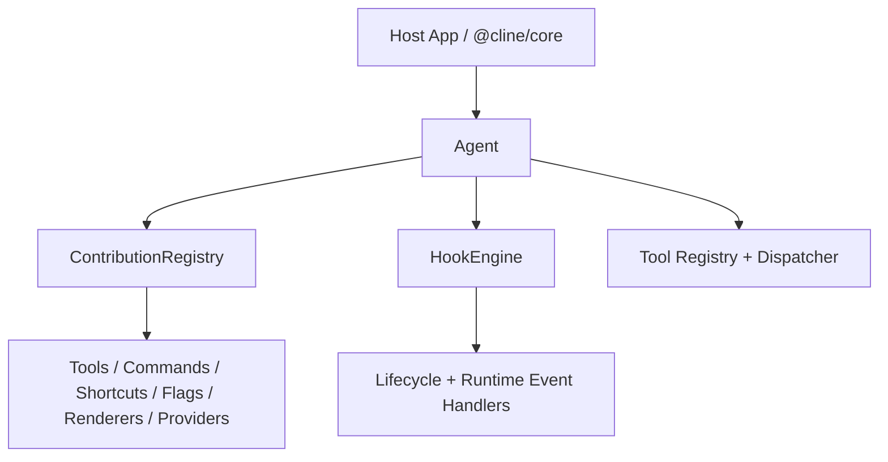

# @cline/agents Architecture

`@cline/agents` is the stateless runtime layer for:

- agent loop execution
- hook dispatch and policies
- extension contribution registration
- in-memory team orchestration

Stateful concerns (plugin discovery/loading, trust/sandbox policy, persistence) belong in `@cline/core`.

## Runtime Layers



## Execution Model: Flow + State

This package keeps one canonical in-memory conversation (`providers.Message[]`) and
iterates until it can return a final answer.

### Conversation state buckets

- Persistent per conversation:
  - `messages`: full conversation history used for future turns
  - `conversationId`: reset by `run()`, `clearHistory()`, and `restore()`
  - `sessionStarted`: ensures `session_start` runs once per conversation
- Ephemeral per run:
  - `activeRunId`
  - `abortController`
  - loop counters, aggregated usage, collected tool call records

### `run()` vs `continue()` vs `restore()`

- `run(input)` starts a new conversation and clears previous history.
- `continue(input)` appends a new user message to existing history.
- `restore(messages)` (or `initialMessages`) preloads history for resume flows; use `continue()` next to preserve that history.

### Message preparation path

Before each model call, history is copied and normalized for API safety:

```text
Canonical History (this.messages)
  -> MessageBuilder.buildForApi(...)
  -> requestMessages
  -> handler.createMessage(systemPrompt, requestMessages, toolDefinitions)
```

`MessageBuilder` can trim oversized tool outputs and mark superseded read-file results while leaving canonical history unchanged.

### Iteration loop (high level)

```text
user input
  -> iteration_start
  -> turn_start
  -> before_agent_start
  -> model stream (text/reasoning/tool_calls/usage)
  -> assistant message persisted
  -> if no tool calls: iteration_end + done
  -> if tool calls:
       execute tools in parallel
       persist tool_result message
       iteration_end
       next iteration
```

Tool-call arguments are buffered from stream chunks and finalized at end-of-turn using `parseJsonStream`, so tools execute against finalized payloads instead of partial JSON fragments.

### Runtime event sequence

`AgentEvent` (from `onEvent`) uses these event types:

- `iteration_start`
- `content_start` (`text` | `reasoning` | `tool`)
- `content_end` (`text` | `reasoning` | `tool`)
- `usage`
- `iteration_end`
- `done`
- `error`

Typical no-tool run:

```text
run("hello")
  -> iteration_start
  -> content_start (text) ... [streaming chunks]
  -> content_end (text)
  -> usage
  -> iteration_end { hadToolCalls: false }
  -> done { reason: "completed" }
```

Typical tool-assisted run:

```text
run("inspect project")
  -> iteration_start
  -> content_start/content_end (text and/or reasoning)
  -> usage
  -> content_start (tool) [per tool execution]
  -> content_end (tool)
  -> iteration_end { hadToolCalls: true }
  -> [next iteration begins]
  -> ...
  -> done
```

### Lifecycle hook order

Blocking hook stages are dispatched in this order during a run:

1. `session_start` (first run in a conversation only)
2. `run_start`
3. For each iteration:
   - `iteration_start`
   - `turn_start`
   - `before_agent_start`
   - `tool_call_before` / `tool_call_after` (for each tool call when present)
   - `turn_end`
   - `iteration_end`
4. `run_end`

Additional stages:

- `error` on loop failure
- `session_shutdown` when host calls `agent.shutdown(...)`
- `runtime_event` for extension-level observation of emitted runtime events

## Hook System

`HookEngine` is the only runtime hook execution path.

### Hook stages

- `input`
- `session_start`
- `run_start`
- `iteration_start`
- `turn_start`
- `before_agent_start`
- `tool_call_before`
- `tool_call_after`
- `turn_end`
- `iteration_end`
- `run_end`
- `runtime_event`
- `session_shutdown`
- `error`

### Dispatch behavior

- Blocking stages return merged `AgentHookControl`.
- Async stages are queued with per-stage queue and concurrency limits.
- Handler execution order is deterministic: higher `priority` first, then handler name.
- Stage/handler policies control timeout, retries, failure mode, max concurrency, queue limit.

### Control merge model

When multiple blocking handlers return control:

- `cancel`: logical OR
- `context`: newline-joined
- `overrideInput`: last writer wins
- `systemPrompt`: last writer wins
- `appendMessages`: concatenated in handler order

### Hook example

```ts
import { Agent } from "@cline/agents";

const agent = new Agent({
  providerId: "anthropic",
  modelId: "claude-sonnet-4-5-20250929",
  systemPrompt: "You are a helpful assistant.",
  tools: [],
  hooks: {
    onRunStart: ({ userMessage }) => {
      if (userMessage.includes("forbidden")) {
        return { cancel: true, context: "Request blocked by policy." };
      }
      return undefined;
    },
    onToolCallStart: ({ call }) => {
      if (call.name === "run_commands") {
        return { context: "Shell command execution requires strict review." };
      }
      return undefined;
    },
    onError: async ({ error }) => {
      console.error("Agent hook error:", error.message);
    },
  },
});
```

## Plugin/Extension System

Extensions use manifest-first contracts plus deterministic setup lifecycle.

### Manifest contract

Each extension must declare:

- `manifest.capabilities` (required)
- `manifest.hookStages` (required when `hooks` capability is used)

Capabilities:

- `hooks`
- `tools`
- `commands`
- `shortcuts`
- `flags`
- `message_renderers`
- `providers`

Hook stages in manifest are validated against implemented handlers. Mismatches fail fast during initialization.

### Deterministic extension lifecycle

`ContributionRegistry` phases:

1. `resolve`
2. `validate`
3. `setup`
4. `activate`
5. `run`

No dynamic extension registration occurs during `run`.

### Responsibilities split

Inside `@cline/agents`:

- validate extension manifests
- register contributions via `setup(api)`
- register hook handlers to `HookEngine`

Outside `@cline/agents` (in `@cline/core`):

- discover modules from disk
- load/instantiate modules
- apply trust/sandbox policy
- persist plugin/runtime state

### Extension example: hooks + contributions

```ts
import type { AgentExtension } from "@cline/agents";
import { createTool } from "@cline/agents";

const echoTool = createTool({
  name: "ext_echo",
  description: "Echo a value",
  inputSchema: {
    type: "object",
    properties: { value: { type: "string" } },
    required: ["value"],
  },
  execute: async ({ value }: { value: string }) => ({ value }),
});

export const extension: AgentExtension = {
  name: "example-extension",
  manifest: {
    capabilities: ["hooks", "tools", "commands"],
    hookStages: ["input", "runtime_event"],
  },
  setup: (api) => {
    api.registerTool(echoTool);
    api.registerCommand({
      name: "ext:hello",
      description: "Example extension command",
      handler: () => "hello",
    });
  },
  onInput: ({ input }) => {
    if (input.startsWith("/safe ")) {
      return { overrideInput: input.replace("/safe ", "") };
    }
    return undefined;
  },
  onRuntimeEvent: async ({ event }) => {
    if (event.type === "error") {
      console.error("runtime error event");
    }
  },
};
```

### Agent wiring example

```ts
import { Agent } from "@cline/agents";
import { extension } from "./my-extension";

const agent = new Agent({
  providerId: "anthropic",
  modelId: "claude-sonnet-4-5-20250929",
  systemPrompt: "You are a coding assistant.",
  tools: [],
  extensions: [extension],
});

const result = await agent.run("/safe summarize the latest changes");
console.log(result.text);
```

## Performance Guardrails

- Hook stage defaults include bounded timeout/retry behavior.
- Async stages use bounded queue limits.
- Per-stage concurrency budgets are enforced.
- Hook routing is stage-indexed; dispatch does not scan unrelated handlers.
- Extension contribution setup runs once per agent lifecycle.

## Related Docs

- package overview: [`packages/agents/README.md`](./README.md)
- API details: [`packages/agents/DOC.md`](./DOC.md)
- workspace architecture: [`packages/ARCHITECTURE.md`](../ARCHITECTURE.md)
